# 2020cce
## 第一週 實習課程式
### 第一題 基礎題：整數轉換為等級
```C
#include <stdio.h>
int main()
{
	int n;
	scanf("%d",&n);
	
	if(n>=90) printf("A\n");
	else if(n>=80) printf("B\n");
	else if(n>=60) printf("C\n");
	else printf("F\n");

}
```
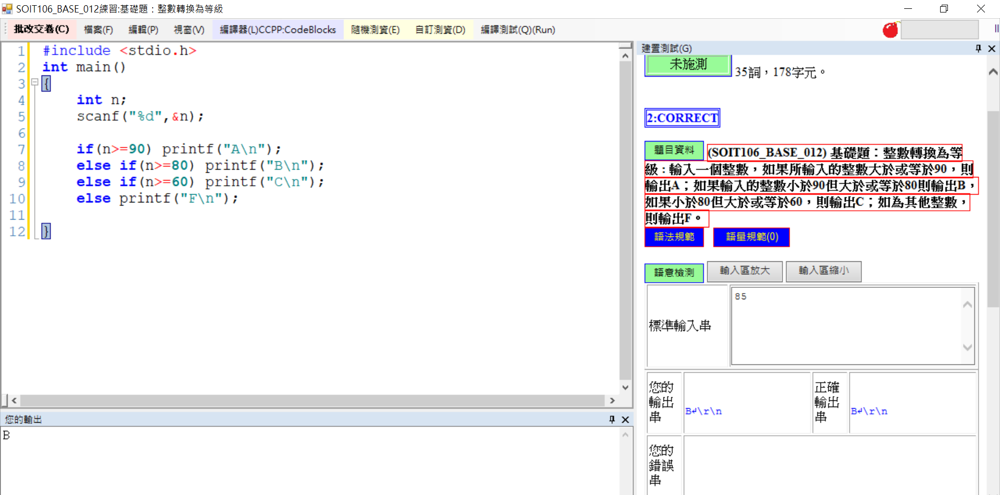
### 第二題 基礎題：找倍數
```C
#include <stdio.h>
int main()
{
	int a[10],ans=0;
	
	for(int i=0; i<10; i++){
		scanf("%d",&a[i]);
		if( a[i]%3==0 ) ans++;
	}
	printf("%d\n",ans);
}
```
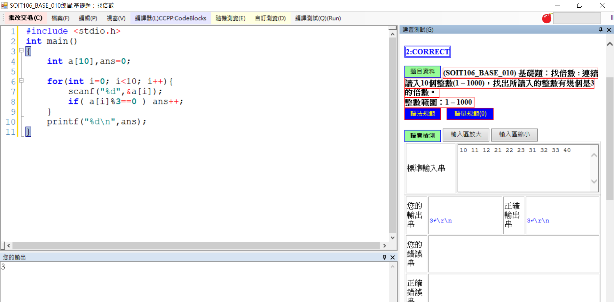
### 第三題 基礎題：因數個數
```C
#include <stdio.h>
int main()
{
	int a,n=0;
	scanf("%d",&a);
	
	for(int i=1; i<=10000; i++ ){
		if(a%i==0) n++;
	}
	printf("%d\n",n);
}
```
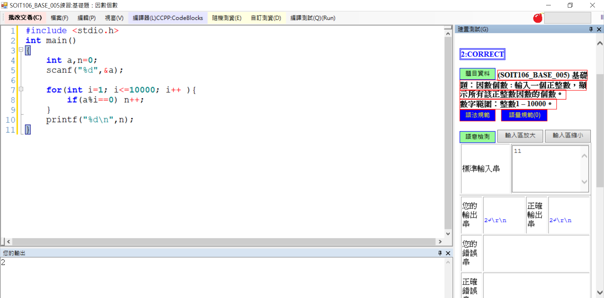
### 第四題 基礎題：找零錢
```C
#include <stdio.h>
int main()
{
	int a,b;
	scanf("%d",&a);
	
	printf("%d=50*%d+5*%d+1*%d\n",a,a/50,a%50/5,a%5);

}
```
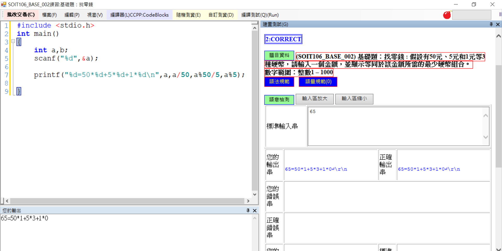
### 第五題 進階題：漸增數列相加
```C
#include <stdio.h>
int main()
{
	int n,ans=0;
	scanf("%d",&n);
	
	for(int i=1; i<n; i++){
		ans+=i*(i+1);
	}
	printf("%d\n",ans);
}
```
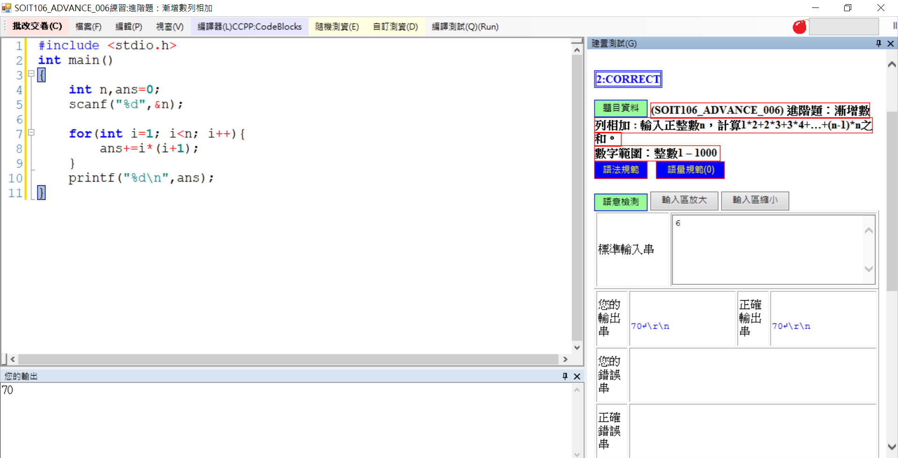
### 第六題 進階題：A的B次方函數
```C
#include <stdio.h>
int MYPOWER(int a,int b)
{
	int n=1;
	for(int i=b; i>=1; i--){
		n=n*a;
	}
	return n;
}

int main(void)
{
	int a,b;
	scanf("%d%d",&a,&b);
	printf("[%d]",MYPOWER(a,b));
	return 0;
}
```
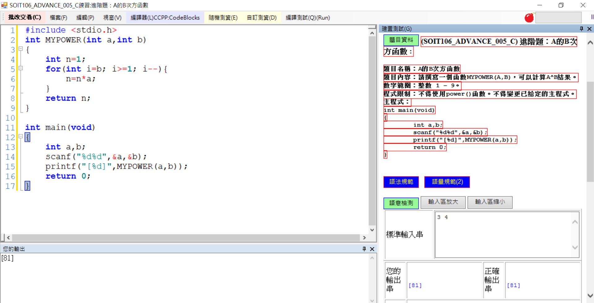
### 第七題 進階題：讀入整數反序列印
```C
#include <stdio.h>
int main()
{
	int a[10],n=0;
	
	for(int i=0; i<10; i++){
		scanf("%d",&a[i]);
		if(a[i]==0) break;
		n++;
	}
	
	for(int i=n-1; i>=0; i--){
		printf("%d ",a[i]);
	}
	printf("\n");
}
```
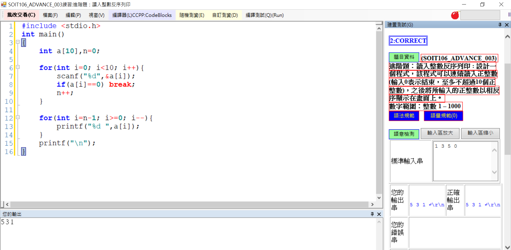
### 第八題 進階題：分式化簡
```C
#include <stdio.h>
int main()
{
	int a,b,n;
	scanf("%d%d",&a,&b);
	
	for(int i=1; i<10000; i++){
		if(a%i==0 && b%i==0) n=i;
	}
	
	printf("%d %d\n",a/n,b/n);
}
```
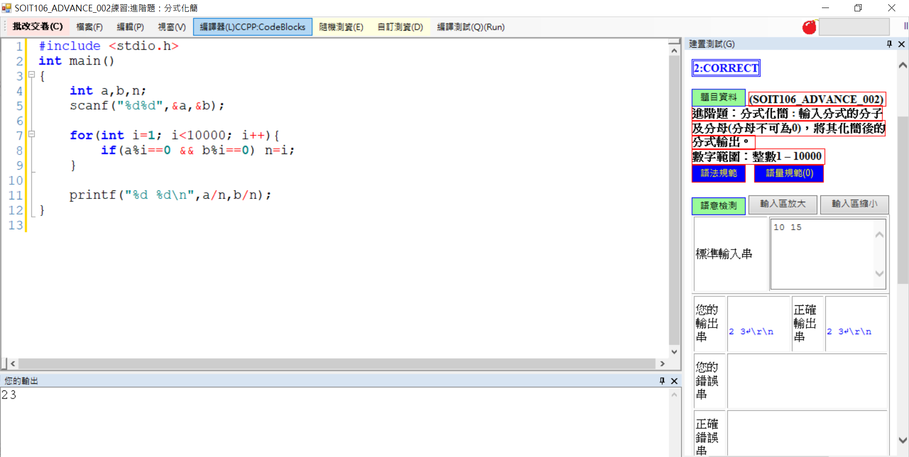

## 第二週 正課程式
### 第一題
```C
#include <stdio.h>
int main()
{
    int n1=10,n2=20,n3=30;
    printf("n1:%d n2:%d n3:%d\n",n1,n2,n3);

    int *p=&n1;
    *p=200;
    printf("n1:%d n2:%d n3:%d\n",n1,n2,n3);

    return 0;
}
```


### 第二題
```C
#include <stdio.h>
int main()
{
    int n1=10,n2=20,n3=30;
    printf("n1:%d n2:%d n3:%d\n",n1,n2,n3);

    int *p=&n1;
    *p=200;
    printf("n1:%d n2:%d n3:%d\n",n1,n2,n3);

    int *p2=&n3;
    *p2=300;
    printf("n1:%d n2:%d n3:%d\n",n1,n2,n3);

    return 0;
}
```


### 第三題
```C
int main()
{
    int n1=10,n2=20,n3=30;
    printf("n1:%d n2:%d n3:%d\n",n1,n2,n3);

    int *p=&n1;
    *p=200;
    printf("n1:%d n2:%d n3:%d\n",n1,n2,n3);

    int *p2=&n3;
    *p2=300;
    printf("n1:%d n2:%d n3:%d\n",n1,n2,n3);

    p2=p;
    *p2=400;
    printf("n1:%d n2:%d n3:%d\n",n1,n2,n3);
    return 0;
}
```


### 第四題
```C
#include <stdio.h>
int main()
{
    int n[3]={10,20,30};
    printf("n[0]:%d n[1]:%d n[2]:%d\n",n[0],n[1],n[2]);

    int *p=&n[0];
    *p=200;
    printf("n[0]:%d n[1]:%d n[2]:%d\n",n[0],n[1],n[2]);

    int *p2=&n[2];
    *p2=300;
    printf("n[0]:%d n[1]:%d n[2]:%d\n",n[0],n[1],n[2]);

    p2=p;
    *p2=400;
    printf("n[0]:%d n[1]:%d n[2]:%d\n",n[0],n[1],n[2]);

    return 0;
}
```


## 第三週 實習課程式
### 基礎題：計算幾週與幾天 
```C
#include <stdio.h>
int main()\
{
	int a,b,n;
	scanf("%d",&n);
	
	a=n/7;
	b=n%7;
	printf("%d %d\n",a,b);


}
```
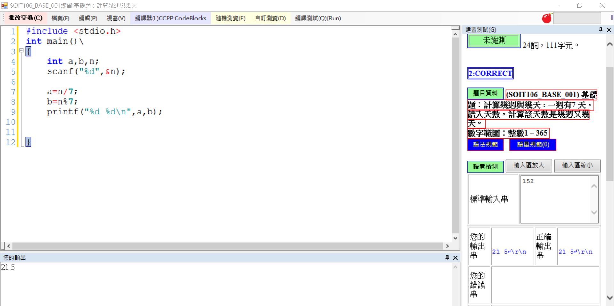
### 基礎題：計程車資計算 
```C
#include <stdio.h>
int main()
{
	int a,ans=100;
	scanf("%d",&a);
	
	a=a-2000;
	ans+=a/500*5;
	if(a%500!=0) ans=ans+5;
	
	printf("%d\n",ans);
}

```
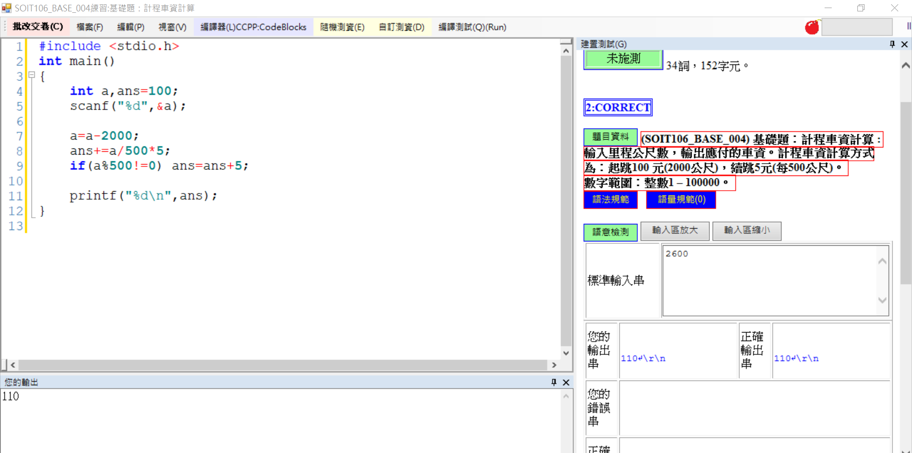
### 基礎題：兩數間可被5整除的整數 
```C
#include <stdio.h>
int main()
{
	int a,b;
	scanf("%d%d",&a,&b);
	
	if(b>a){
	for(int i=a; i<=b; i++){
		if(i%5==0) printf("%d\n",i);
	}
	}
	
	else if(a>b){
	for(int i=b; i<=a; i++){
		if(i%5==0) printf("%d\n",i);
	}
	}
	
}
```
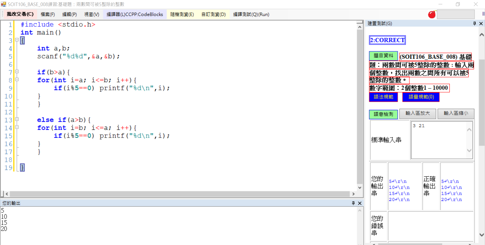
### 基礎題：整數間最大距離
```C
#include <stdio.h>
int main()
{
	int a,b,c,ans;
	scanf("%d%d%d",&a,&b,&c);
	
	if(a>b){
		int temp=b;
			b=a;
			a=temp;
	}
	if(b>c){
		int temp=b;
			b=c;
			c=temp;
	}
	if(b<a){
		int temp=a;
			a=b;
			b=temp;
	}
	
	
	printf("%d\n",c-a);
}
```
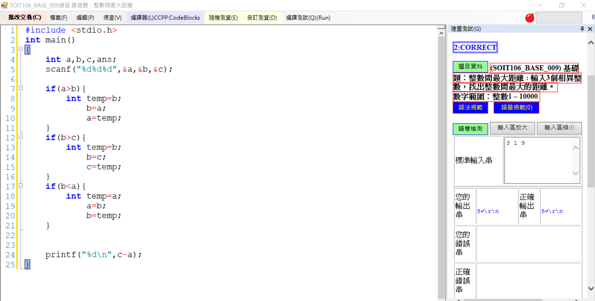
### 進階題：大小寫轉換
```C
#include <stdio.h>
int main()
{
	char a[10];
	scanf("%s",&a);
	
	for(int i=0; a[i]!=0; i++){
		if(a[i]>='A'&& a[i]<='Z'){
			a[i]+=32;
			printf("%c",a[i]);
			
		}
		else if(a[i]>='a'&& a[i]<='z'){
			a[i]-=32;
			printf("%c",a[i]);
		}
		else printf("%c",a[i]);
	}
	printf("\n");
		
}
```
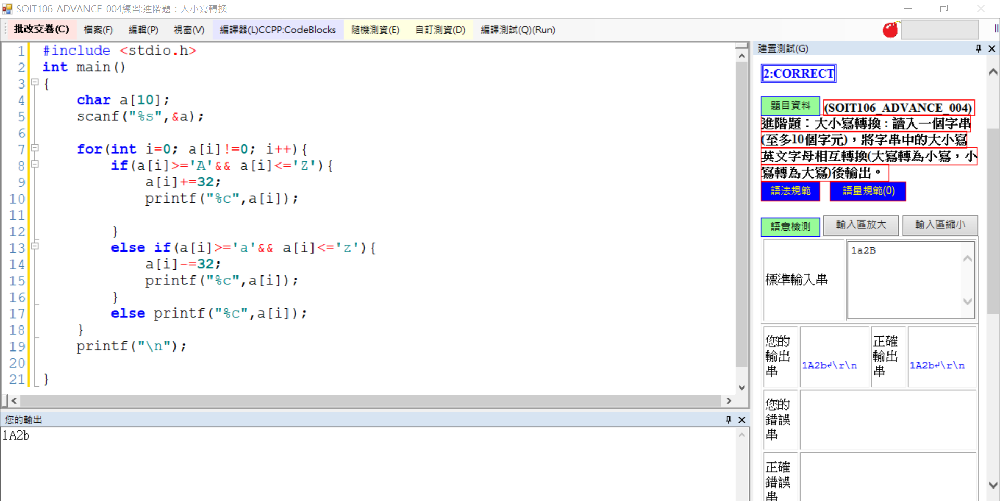
### 進階題：漸增數列相加  
```C
#include <stdio.h>
int main()
{
	int n,ans=0;
	scanf("%d",&n);
	
	for(int i=2; i<=n; i++){
		ans=ans+(i-1)*i;
	}
	printf("%d\n",ans);
}
```
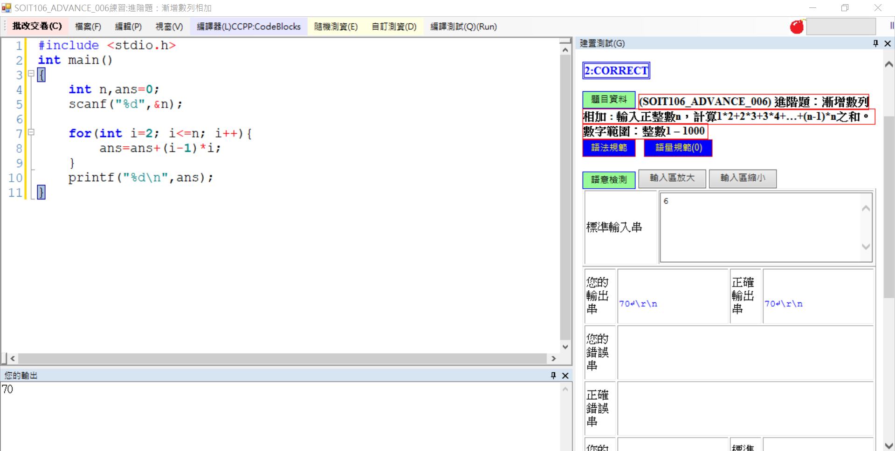
### 進階題：計算陣列的平方值 
```C
#include <stdio.h>
int main()
{
	int n,a[10],c=0;
	scanf("%d",&n);
	for(int i=0; i<n;i++){
		scanf("%d",&a[i]);
		printf("%d,",a[i]*a[i]);
	}
	printf("\n");
}
```
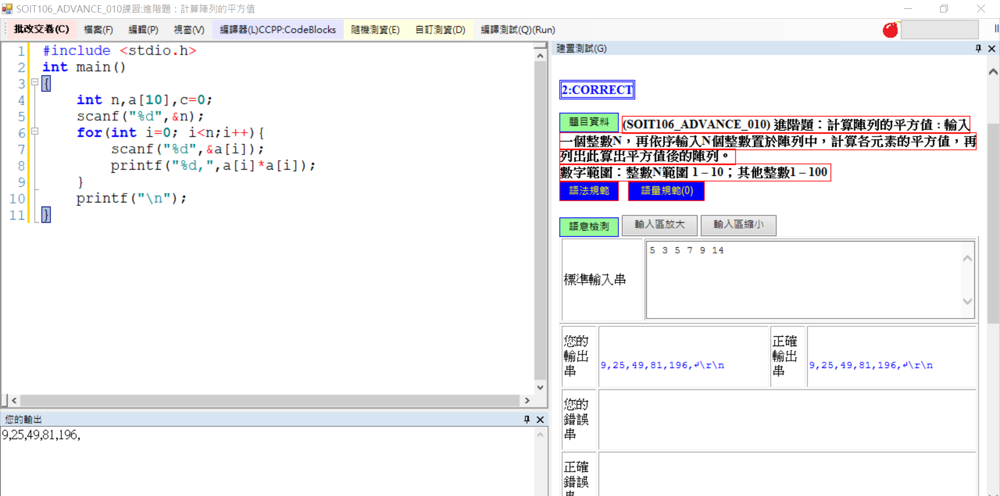
### 進階題：2進位轉10進位
```C
#include <stdio.h>
int main()
{
	int n,a,b,c,d;
	scanf("%d",&n);
	
	a=n/1000;
	b=n%1000/100;
	c=n%1000%100/10;
	d=n%10;
	
	printf("%d\n",a*8+b*4+c*2+d*1);
}
```
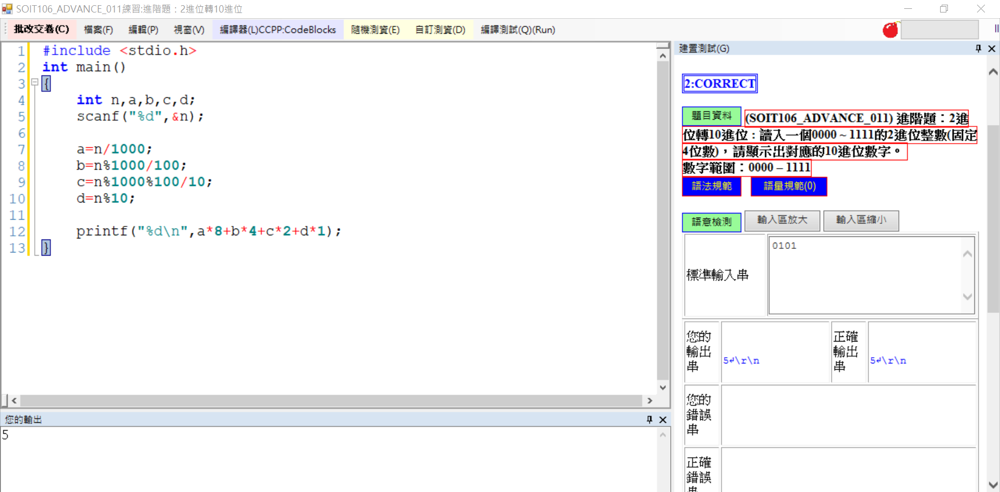
## 第三週 正課程式
### 第一題
```C
#include <stdio.h>
int a[5]={0,10,20,30,40};
int main()
{
    int *p = &a[2];
    *p=222;
    
    p= p+2;
    *p=666;
    
    p--;
    *p=555;
    
}

```
### 第二題
```C
#include <stdio.h>
int a[5]={0,10,20,30,40};
void printfAll()
{
    for(int i=0; i<5; i++){
        printf("%d ",a[i]);
    }
    printf("\n");
}
int main()
{
    int *p = &a[2];
    *p=222;
    printfAll();

    p= p+2;
    *p=666;
    printfAll();

    p--;
    *p=555;
    printfAll();

}

```
### 第三題
```C
#include <stdio.h>
int a[10]={0,10,20,30,40,50,60,70,80,90};
void printfAll()
{
    for(int i=0; i<10; i++){
        printf("%3d ",a[i]);
    }
    printf("\n");
}
int main()
{
    int *p = &a[2];
    *p=222;
    printfAll();

    int *p2= p+4;
    *p2=666;
    printfAll();

    p2--;
    *p2=555;
    printfAll();

}
```

### 第四題
```C
#include <stdio.h>
#include <stdlib.h>

int a[10];
int main()
{
    int b[10];
    
    int *p=(int*) malloc( sizeof (int)*10);
    
    return 0;
}
```
## 第四週 實習課程式
### 基礎題：輸出從0到N的偶數
```C
#include <stdio.h>
int main()
{
	int n;
	scanf("%d",&n);
	
	for(int i=1; i<=n; i++){
		if(i%2==0) printf("%d ",i);
	}
	
}
```
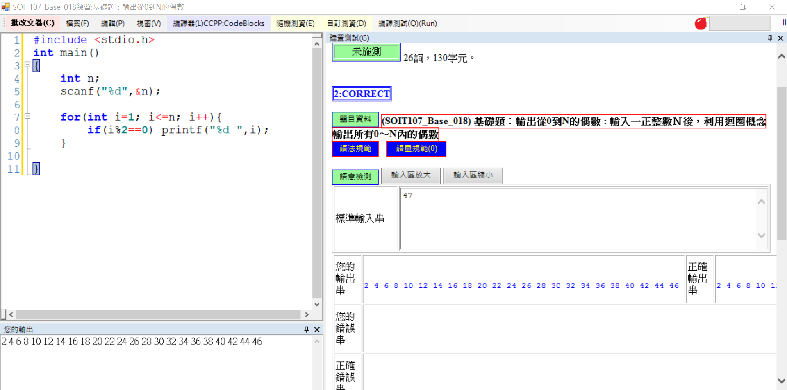
### 基礎題：基礎題：數字之首
```C
#include <stdio.h>
int main()
{
	int n,a;
	scanf("%d",&n);
	if(n<100) a=n/10;
	else if(n<1000) a=n/100;
	else if(n<10000) a=n/1000;
	else if(n<100000) a=n/10000;
	printf("%d",a);
}
```
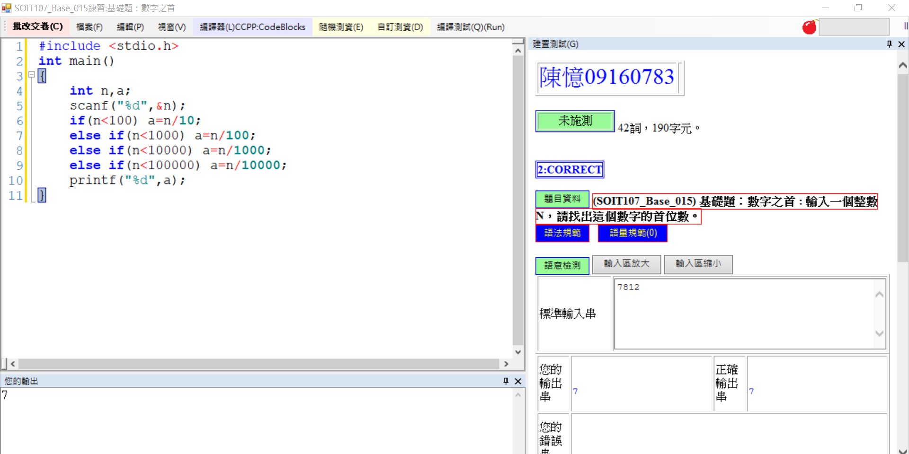
### 基礎題：基礎題：字元判別
```C
#include <stdio.h>
int main()
{
	char n;
	scanf("%c",&n);
	if(n>='A' && n<='Z') printf("U");
	else if(n>='a' && n<='z') printf("L");
	else if(n>='0' && n<='9') printf("D");
	else printf("O");
}
```
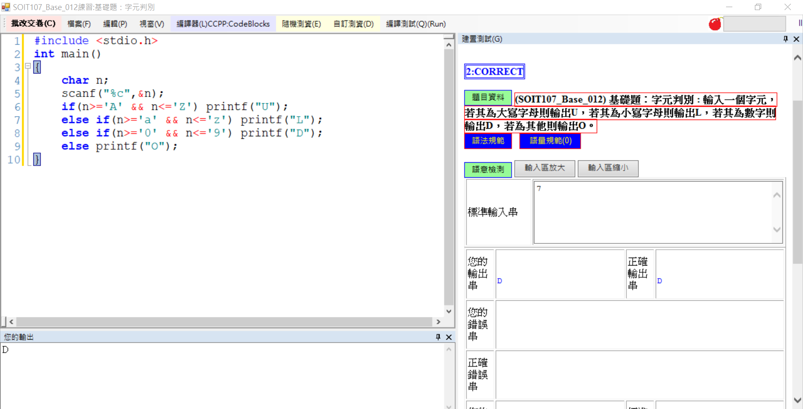
### 基礎題：分開整數的每個數字
```C
#include <stdio.h>
int main()
{
	int n;
	scanf("%d",&n);
	
	int a=n/10000;
	int b=n%10000/1000;
	int c=n%1000/100;
	int d=n%100/10;
	int e=n%10;
	
	printf("%d   %d   %d   %d   %d",a,b,c,d,e);
}
```
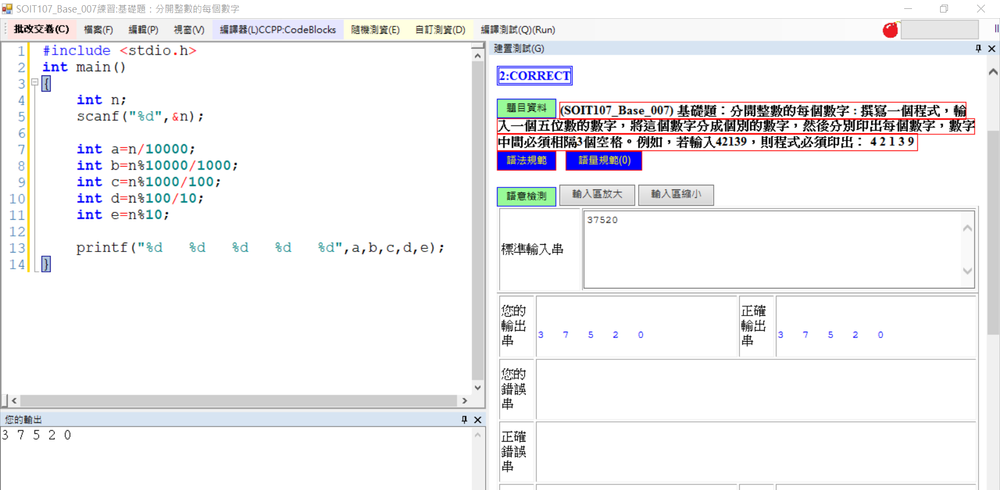
### 進階題：星星等腰三角
```C
#include <stdio.h>
int main()
{
	int n;
	scanf("%d",&n);
	
	for(int i=1; i<=n; i++){
		int space=n-i;
		for(int k=1; k<=space; k++){
			printf(" ");
		}
		
		int star=2*i-1;
		for(int k=1; k<=star; k++){
		printf("*");
		}
		printf("\n");
	}
}
```
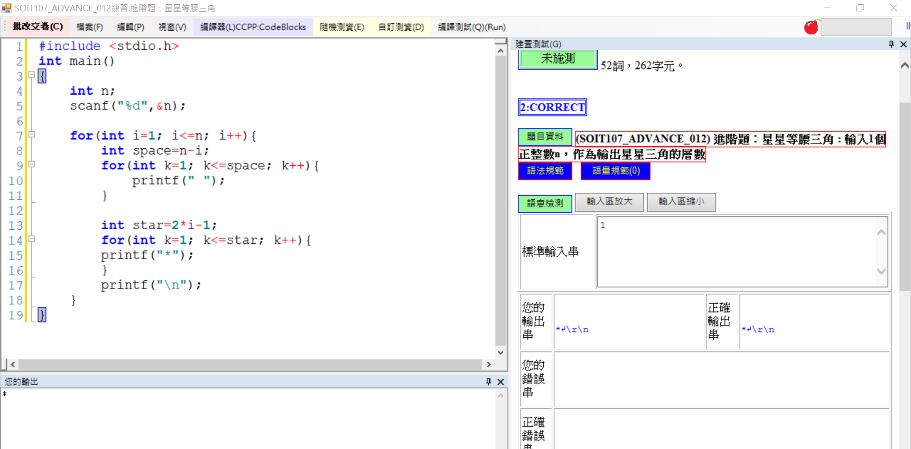
### 進階題:函數找整數的最大數字
```C
#include <stdio.h>

int max_digit(int a){
	int x,y=0;
	for(int i=1; a>1; i++){
		x=a%10;
		a=a/10;
		if(x>y) y=x;
	
	}
	return y;
}

int main(void){
  int n;
  scanf("%d", &n);
  printf("[%d]", max_digit(n));
  return 0;
}
```
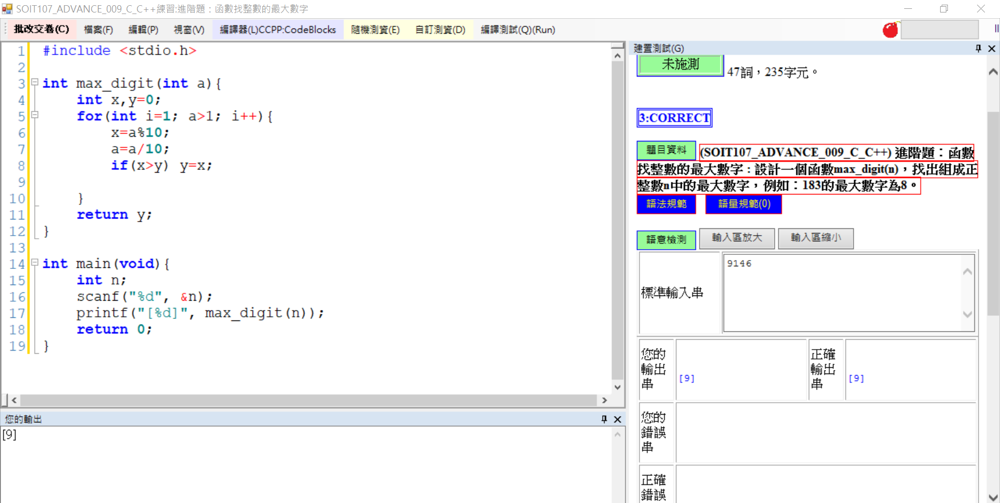
### 進階題：擲骰統計
```C
#include <stdio.h>
int main()
{
	char s[100],a=0,b=0,c=0,d=0,e=0,f=0;
	scanf("%s",&s);
	for(int i=0; s[i]!='\0'; i++){
		if     (s[i]=='1') a++;
		else if(s[i]=='2') b++;
		else if(s[i]=='3') c++;
		else if(s[i]=='4') d++;
		else if(s[i]=='5') e++;
		else if(s[i]=='6') f++;
	}
	printf("1:%d\n2:%d\n3:%d\n4:%d\n5:%d\n6:%d\n",a,b,c,d,e,f);
}
```
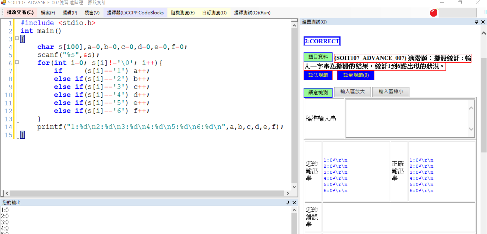
### 進階題：除惡務盡
```C
#include <stdio.h>
int main()
{
	char n[100];
	scanf("%s",&n);
	for(int i=0; n[i]!=0; i++){
		
		if(n[i]!='2') printf("%c",n[i]);
	}
	printf("\n");
	
	
}
```
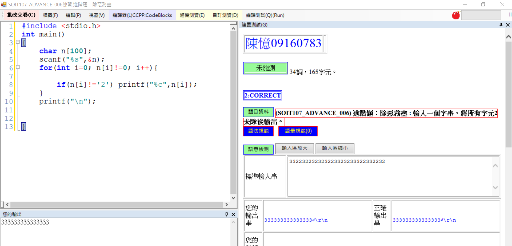

## 第四週 正課程式
### 第一題
```C
#include <stdio.h>
struct DATA{///宣告
    float x,y,z;///定義裡面有...
} point1 ;

int main()
{

}
```
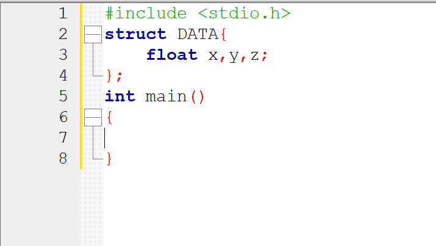
### 第二題
```C
#include <stdio.h>
struct DATA{///宣告
    float x,y,z;///定義裡面有...
} point1 ;

///point1 是變數，長得像DATA
///DATA裡面有 x,y,z

int main()
{   
    point1.x=3;///使用(裡面的值)
    point1.y=5;///使用
    point1.z=7;///使用
    printf("%f %f %f\n",point1.x,point1.y,point1.z);
    
}
```
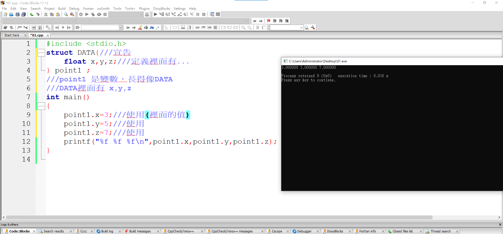
### 第三題
```C
#include <stdio.h>
struct DATA{///宣告
    float x,y,z;///定義裡面有...
} point1 ;
struct DATA points[5];

///point1 是變數，長得像DATA
///DATA裡面有 x,y,z

int main()
{
    ///int b;
    ///int a[5];
    for(int i=0; i<5; i++){
        points[i].x=i*10;
        points[i].y=20;
        points[i].z=0;
        printf("%f %f %f\n",points[i].x,points[i].y,points[i].z);
    }
}
```
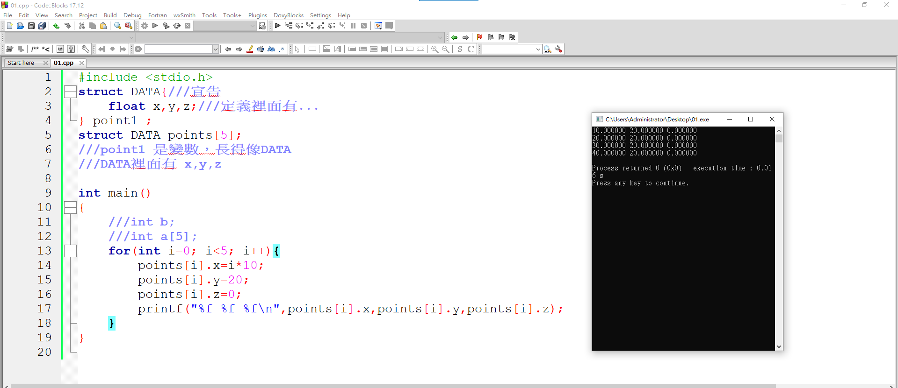
### 第四題
```C
#include <stdio.h>
struct DATA{
    float x, y, z;
} a, b, c;
struct DATA points[5];

int main()
{
    struct DATA d, e, f;

    for(int i=0; i<5; i++){
        points[i].x=i*10;
        points[i].y=20;
        points[i].z=0;
        printf("%f %f %f\n",points[i].x,points[i].y,points[i].z);
    }
}
```
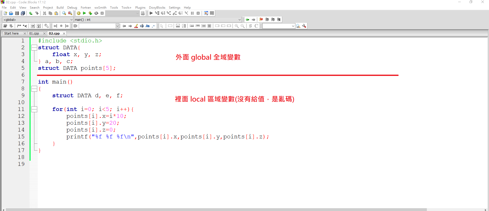
### 第五題
```C
#include <stdio.h>
struct DATA{
    float x, y, z;
} a, b;
struct DATA c,d;

int main()
{
    struct DATA e;
    struct DATA f={1, 2, 3};///宣告的同時，可以初始值


    printf("%f %f %f\n", a.x, a.y, a.z);
    printf("%f %f %f\n", b.x, b.y, b.z);
    printf("%f %f %f\n", c.x, c.y, c.z);
    printf("%f %f %f\n", d.x, d.y, d.z);
    printf("%f %f %f\n", e.x, e.y, e.z);
    printf("%f %f %f\n", f.x, f.y, f.z);

}
```

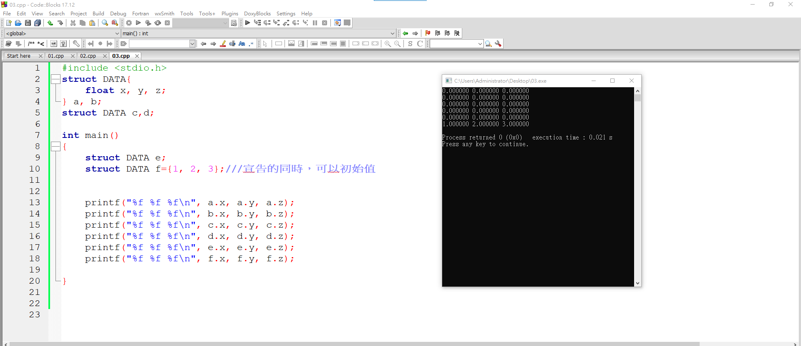
## 第五週 實習課程式
### 基礎題:計算商數 
```C
#include <stdio.h>
int main()
{
	int a,b;
	scanf("%d%d",&a,&b);
	
	printf("%d\n",a/b);

}
```
### 基礎題:三數極大
```C
#include <stdio.h>
int main()
{
	int a,b,c;
	scanf("%d%d%d",&a,&b,&c);
	
	if(a>b){
		int temp=a;
		a=b;
		b=temp;
	}
	if(b>c){
		int temp=b;
		b=c;
		c=temp;
	}
	if(a>c){
		int temp=c;
		a=c;
		c=temp;
	}
	printf("%d\n",c);

}
```
### 基礎題:N數之和
```C
#include <stdio.h>
int main()
{
	int n,a,ans=0;
	scanf("%d",&n);
	
	for(int i=1; i<=n; i++){
		scanf("%d",&a);
		ans=ans+a;
	}
	printf("%d\n",ans);
}
```
### 進階題:絕對值函數 
```C
#include <stdio.h>
int f(int n)
{
	int a;
	if(n<1) a=n*(-1);
	else if(n>1) a=a;
	return a;
}

int main(void)
{
	int n;
	scanf("%d",&n);
	printf("[%d]",f(n));
	return 0;
}
```
### 進階題:反序數字 
```C
#include <stdio.h>
int main()
{
	int a,b;
	scanf("%d",&a);
	
	if(a<100)
	b=a/10+a%10*10;
	
	else if(a<1000)
	b=a/100+a%100/10*10+a%10*100;
	
	else if(a<10000)
	b=a/1000+a%1000/100*10+a%100/10*100+a%10*1000;
	
	printf("%d+%d=%d\n",a,b,a+b);

}

```
## 第五週 正課程式
### 第一題
```C
#include <stdio.h>
char line[20]="233233233233233233";
int main()
{
    char *p = line;
    ///scanf("%s",line);
    for(int i=0; line[i]!=0; i++){
        p = &line[i];
        char c = line[i];
        if(c!='2') printf("%c",c);
    }
    printf("\n");
}
```
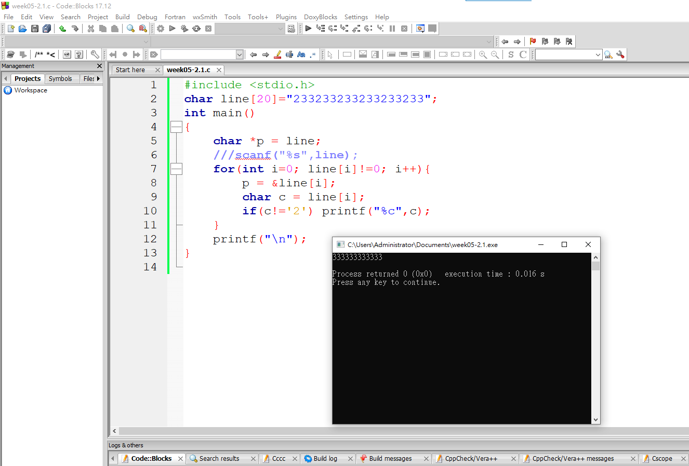
### 第二題
```C
#include <stdio.h>
int main()
{
    char line[10]= "decline";
    char line2[10]= {'p','r','o','p','e','r','\0'};

    printf("%s\n",line);
    printf("%s\n",line2);
}
```
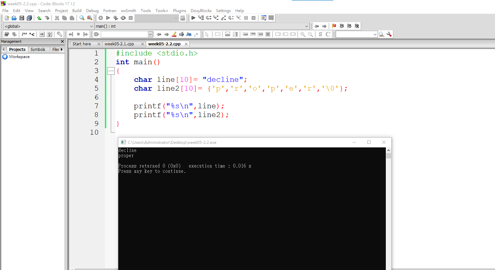
### 第三題
```C
#include <stdio.h>
int main()
{
    char line[10]= "decline";
    char line2[10]= {'p','r','o','p','e','r','\0'};

    printf("%s\n",line);
    printf("%s\n",line2);

    char line3[]="majority這是好的，沒問題，要多長有多長";
    char line4[]={'m','a','j','o','r','i','t','y'};
    printf("%s\n",line3);

    printf("你相信嗎? 這是 line4:==%s==\n", line4 );

}
```
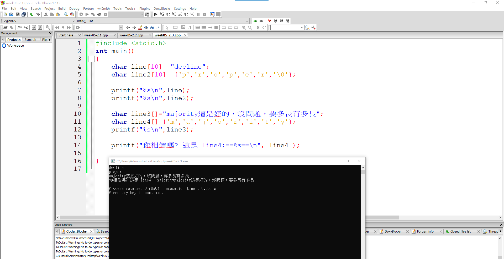
### 第四題
```C
#include <stdio.h>
int main()
{
    char line[5][10]= {"decline","proper","majority","bullet","shop"};
    //char *p;
    for(int i=0; i<5; i++){
        //p = &line[i];
        printf("%s\n",line[i]);
    }


}
```
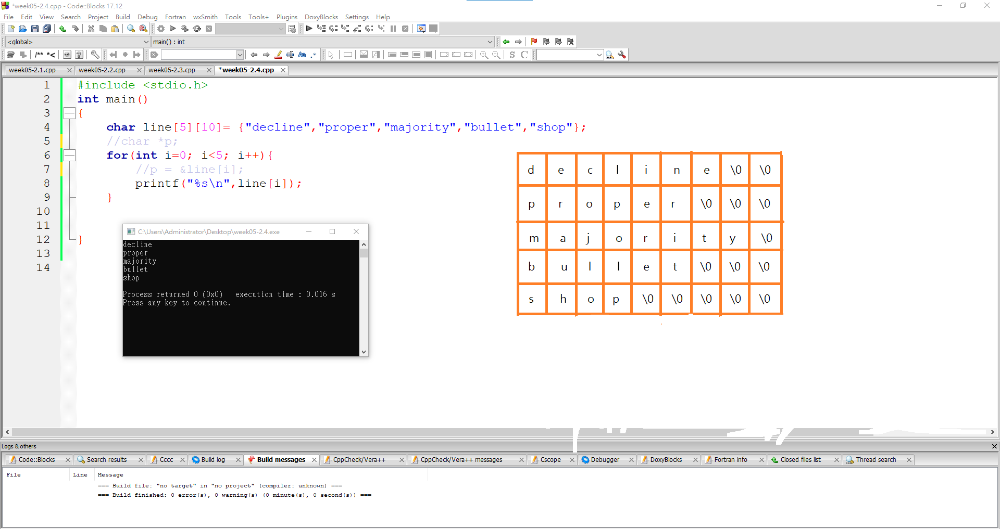
### 第五題
```C
#include <stdio.h>
int a[3][3]={ {1,2,3}, {4,5,6}, {7,8,9} };
int main()
{
    for(int i=0; i<3; i++){
        for(int j=0; j<3; j++){
            printf("%d ",a[i][j]);

        }
        printf("\n");
    }
}
```
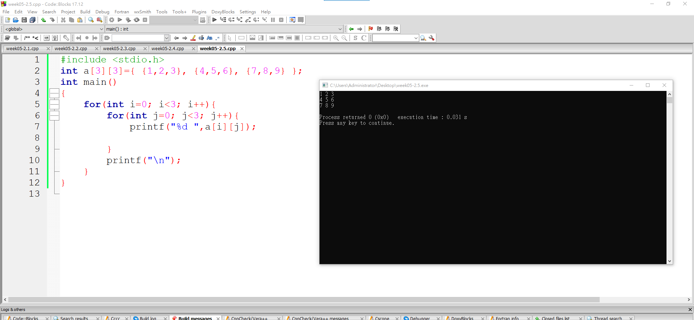
## 第六週 實習課程式
### 基礎題：整數轉換等級
```C
#include <stdio.h>
int main()
{
	int n;
	scanf("%d",&n);
	
	if(n>=90) printf("A");
	else if(n>=80) printf("B");
	else if(n>=70) printf("C");
	else if(n>=60) printf("D");
	else printf("F");
}
```
### 基礎題：計算餘數
```C
#include <stdio.h>
int main()
{
	int a,b;
	scanf("%d%d",&a,&b);

	printf("%d",a%b);
}
```
### 基礎題：計程車資計算 
```C
#include <stdio.h>
int main()
{
	int n,ans=100;
	scanf("%d",&n);
	
	if(n<1500) printf("%d",ans);
	else if(n>1500){ 
		n=n-1500;
		ans+=n/250*5;
	
		if(n%250!=0) ans=ans+5;
	}
	printf("%d",ans);
	

}

```
### 基礎題：找零錢
```C
#include <stdio.h>
int main()
{
	int n,a,b,c,d;
	scanf("%d",&n);
	
	a=n/50;
	b=n%50/10;
	c=n%10/5;
	d=n%5;
	
	printf("%d=50*%d+10*%d+5*%d+1*%d",n,a,b,c,d);

}
```
### 進階題：計算一列整數的總和
```C
#include <stdio.h>
int main()
{
	int a[100],n=0,ans=0;
	
	for(int i=0; i<100; i++){
		scanf("%d",&a[i]);
		if(a[i]==999) break;
		n++;
	}
	
	for(int i=0; i<n; i++){
		printf("Enter an integer ( 999 to end ): \n");
		ans=ans+a[i];
	}
	
	printf("Enter an integer ( 999 to end ): \n");
	printf("The total is: %d",ans);
}
```
### 進階題：判斷大小
```C
#include <stdio.h>
int f(int a,int b){
	int n;
	if(a<b) n=-1;
	else if(a==b) n=0;
	else n=1;
	return n; 
}

int main(){
    int a, b;
    scanf("%d %d", &a, &b);
    printf("%d",f(a,b));
    return 0;
}

```

### 進階題：陣列找出現次數 
```C
#include <stdio.h>
int main()
{
	int a[10],b=0,n,ans=0;
	for(int i=0; i<10; i++){
		scanf("%d",&a[i]);
		if(a[i]==0) break;
		b++;
	}
	
	scanf("%d",&n);
	for(int i=0; i<b; i++){
		if(a[i]==n) ans++;
	}
	
	printf("%d\n",ans);
}
```

### 進階題：函數反序排列數字 
```C
#include <stdio.h>
int f(int n)
{
	int a;
	if(n>=1000) a=a/1000 +a%1000/100*10 +a%100/10*100 +a%10*1000;
	else if(n>=100) a=a/100 +a%100/10*10 +a%10*100;
	else if(n>=10) a=n/10 +n%10*10;
	else a=n;
	return a;
}
int main()
{
	int n;
	scanf("%d",&n);
	printf("%d\n",f(n));
	return 0;
}
```

## 第七週 正課程式
### 第一題
```C
#include <stdio.h>
#include <string.h>
#include <stdlib.h>

char a[100][10];
int compare( const void *p1, const void *p2)
{
	char *s1 = (char*)p1;
	char *s2 = (char*)p2;
	return strcmp( s1, s2 );
}


int main()
{
	int n;
	scanf("%d",&n);

	for(int i=0; i<n; i++){
		scanf("%s",a[i]);
	}

	qsort(   a,    n,      10,        compare);
//快速排列(     陣列,  n個,  每個有多大,  比較的函式)

	for(int i=0; i<n; i++){
		printf("%s\n",a[i]);
	}

}

```
### 第二題
```C
#include <stdio.h>
#include <string.h>
int main()
{
	int n,ans=1;
	scanf("%d",&n);
	
	char a[2000][75];
	char temp[75];
	char others[100];
	
	for(int i=0; i<n; i++){
		scanf("%s",a[i]);
		gets(others);
	}
	
	for(int i=0; i<n; i++){
		for(int j=i+1; j<n; j++){
			if( strcmp(a[i],a[j]) > 0 ){
				strcpy(temp,a[i]);
				strcpy(a[i],a[j]);
				strcpy(a[j],temp);
			}
		}
	}
	for(int i=0; i<n; i++){
		if(strcmp(a[i],a[i+1]) == 0 ){
			ans++;
		}
		else{
			printf("%s %d\n",a[i],ans);
			ans=1;
		}
	}

}
```
## 第八週正課
### 字串排序.1
```C
#include <stdio.h>
#include <string.h>
#include <stdlib.h>
char line[100][10];
int compare( const void *p1, const void *p2){
	return strcmp((char*)p1,(char*)p2);
}
int main()
{
	int N;
	scanf("%d",&N);
	
	for(int i=0; i<N; i++){
		scanf("%s",line[i]);
	}
	qsort( line, N, 10, compare);
	for(int i=0; i<N; i++){
		printf("%s\n",line[i]);
	}
}
```
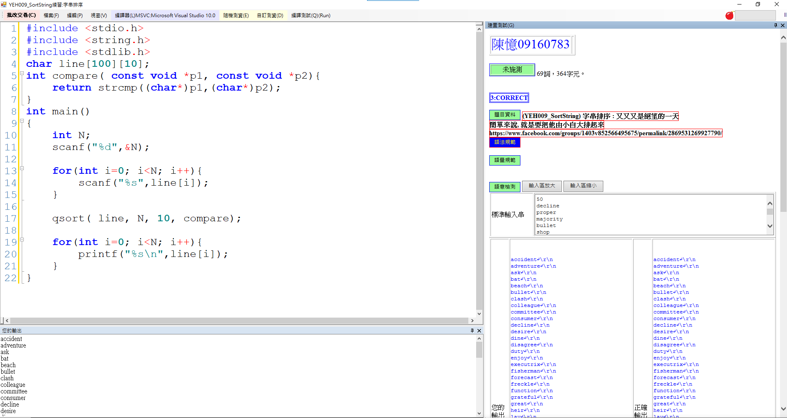
### 字串排序.2
```C
#include <stdio.h>
#include <string.h>
#include <stdlib.h>
char name[2000][80];
char others[80];

int compare(const void *p1, const void *p2){
	return strcmp((char*)p1,(char*)p2);
}

int main()
{
	int n;
	scanf("%d",&n);
	for(int i=0; i<n; i++){
		scanf("%s",name[i]);
		gets(others);
	}	

	qsort(name, n, 80, compare);
	
	int ans=1;
	printf("%s ",name[0]);
	for(int i=0; i<n-1; i++){
		if(strcmp(name[i],name[i+1]) != 0){
			printf("%d\n",ans);
			printf("%s ",name[i+1]);
			ans=1;
		}
		else{
			ans++;
		}
	}
	printf("%d\n",ans);
}
```
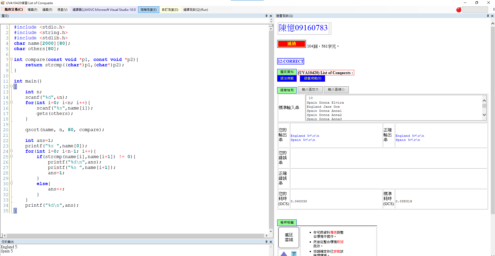
### 字串排序.3
```C
#include <string.h>
#include <stdlib.h>
char tree[100000][32];
int compare( const void *p1,const void*p2)
{
	return strcmp((char*)p1, (char*)p2);
}
int main()
{
	int T;
	scanf("%d\n\n",&T);

	for(int t=0; t<T; t++){
		int N=0;//有幾行讀進來?
		for(int i=0;   ; i++){
			gets( tree[i] );
			if( strcmp(tree[i],"") ==0 ){
				N=i;//要記錄現在的i
				break;//就可以離開了
			}
		}
		
		qsort(tree, N, 32, compare);
		
		int ans=1;
		printf("%s ",tree[0]);
		for(int i=0; i<N-1; i++){
			if( strcmp(tree[i],tree[i+1]) != 0 ){
				printf("%.4f\n",100*ans/(float)N);
				printf("%s ",tree[i+1]);
				ans=1;
			}
			else{
				ans++;
			}
		}
		printf("%.4f\n",100*ans/(float)N);
	}
	
}
```
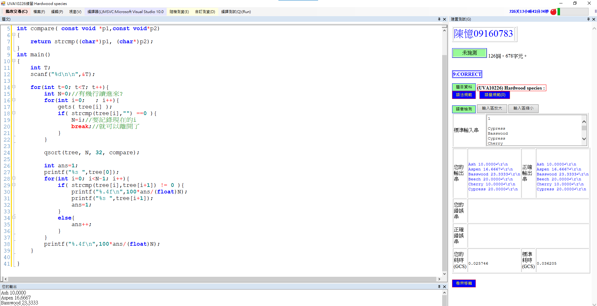
## 字串排序.4
```C
#include <stdio.h>
#include <string.h>
#include <stdlib.h>
char tree[100000][32];
int compare( const void *p1,const void*p2)
{
	return strcmp((char*)p1, (char*)p2);
}
int main()
{
	int T;
	scanf("%d\n\n",&T);

	for(int t=0; t<T; t++){
		int N=0;//有幾行讀進來?
		for(int i=0;   ; i++){
			gets( tree[i] );
			if( strcmp(tree[i],"") ==0 ){
				N=i;//要記錄現在的i
				break;//就可以離開了
			}
		}
		
		qsort(tree, N, 32, compare);
		
		int ans=1;
		printf("%s ",tree[0]);
		for(int i=0; i<N-1; i++){
			if( strcmp(tree[i],tree[i+1]) != 0 ){
				printf("%.4f\n",100*ans/(float)N);
				printf("%s ",tree[i+1]);
				ans=1;
			}
			else{
				ans++;
			}
			memset(tree[i], '\0', 32);
		}
		printf("%.4f\n",100*ans/(float)N);
		if(t!=(T-1)) printf("\n");
	}
	
}
```
## 第十週 正課程式
### UVA 10008(1)
```C
#include <stdio.h>
char line[10000];
char ans[26];
char alphabet[]="ABCDEFGHIJKLMNOPQRSTUVWXYZ";
int main()
{
	int n;
	scanf("%d\n",&n);
	
	for(int i=0; i<n; i++){
		gets(line);
		for(int k=0; line[k]!=0; k++){
			char c= line[k];
			if(c>='A' && c<='Z') ans[ c-'A' ]++;
			else if(c>='a' && c<='z') ans[ c-'a' ]++; 
		}
	}
	
	for(int i=0; i<26; i++){
		for(int j=i+1; j<26; j++){
			if( ans[i]<ans[j] || (ans[i]==ans[j] && alphabet[i]>alphabet[j]) ){
				int temp=ans[i];
				ans[i]=ans[j];
				ans[j]=temp;
				char c = alphabet[i];
				alphabet[i] = alphabet[j];
				alphabet[j] = c;
			}
		}
	}
	
	for(int i=0; i<26; i++){
		if(ans[i]>0) printf("%c %d\n", alphabet[i], ans[i]);
	}
}
```
.PNG)

### UVA 10008(2)
```C
#include <stdio.h>
#include <stdlib.h>
char line[10000];

typedef struct{
	int ans;//char ans[26];
	char c;//char alphabet[]="ABCDEFGHIJKLMNOPQRSTUVWXYZ";
}BOX;
BOX array[26];

int compare(const void *p1, const void *p2){
	if(((BOX*)p1)->ans > ((BOX*)p2)->ans) return -1;
	else if(((BOX*)p1)->ans < ((BOX*)p2)->ans) return +1;
	else if(((BOX*)p1)->c < ((BOX*)p2)->c) return -1;
	else if(((BOX*)p1)->c > ((BOX*)p2)->c) return +1;
	else return 0;
}
int main()
{
	for(int i=0; i<26; i++) array[i].c = 'A'+i;
	int n;
	scanf("%d\n",&n);
	
	for(int i=0; i<n; i++){
		gets(line);
		for(int k=0; line[k]!=0; k++){
			char c= line[k];
			if(c>='A' && c<='Z') array[ c-'A' ].ans++;
			else if(c>='a' && c<='z') array[ c-'a' ].ans++; 
		}
	}
	
	qsort(array, 26, sizeof(BOX), compare);
	
	for(int i=0; i<26; i++){
		if(array[i].ans>0) printf("%c %d\n", array[i].c, array[i].ans);
	}
}
```
.PNG)
