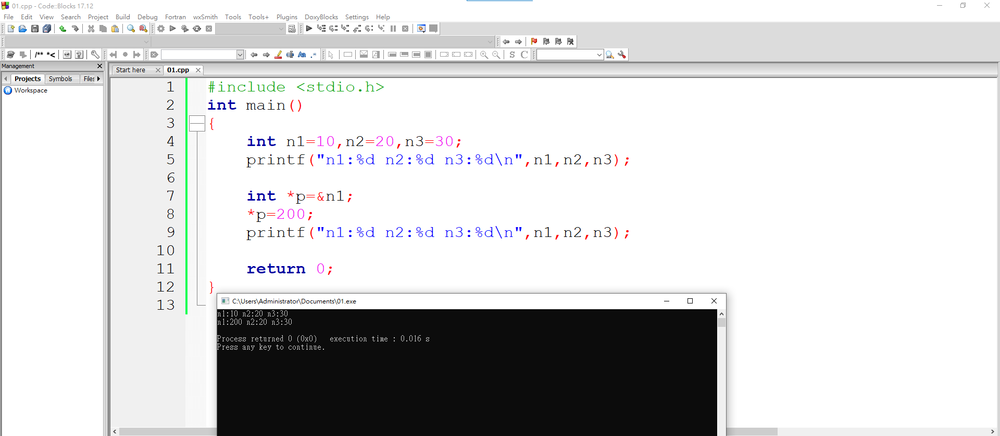
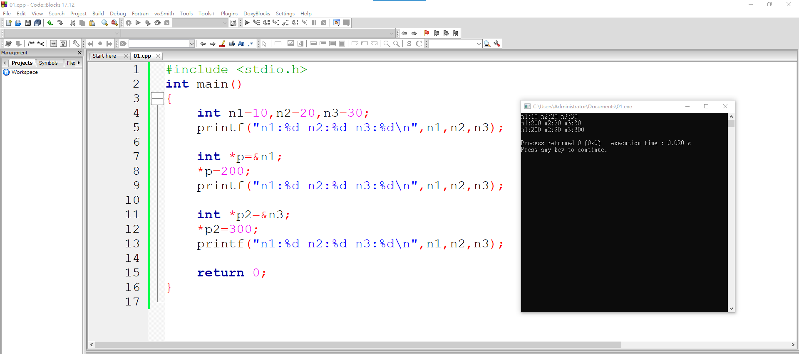
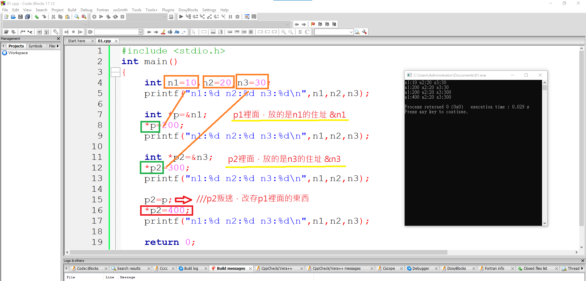
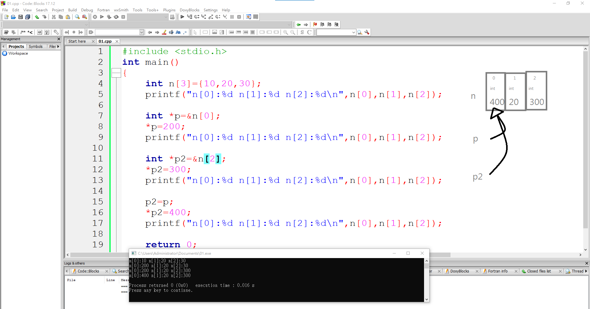

# 2020cce
## 第一週 實習課程式
### 第一題 基礎題：整數轉換為等級
```C
#include <stdio.h>
int main()
{
	int n;
	scanf("%d",&n);
	
	if(n>=90) printf("A\n");
	else if(n>=80) printf("B\n");
	else if(n>=60) printf("C\n");
	else printf("F\n");

}
```

### 第二題 基礎題：找倍數
```C
#include <stdio.h>
int main()
{
	int a[10],ans=0;
	
	for(int i=0; i<10; i++){
		scanf("%d",&a[i]);
		if( a[i]%3==0 ) ans++;
	}
	printf("%d\n",ans);
}
```
### 第三題 基礎題：因數個數
```C
#include <stdio.h>
int main()
{
	int a,n=0;
	scanf("%d",&a);
	
	for(int i=1; i<=10000; i++ ){
		if(a%i==0) n++;
	}
	printf("%d\n",n);
}
```
### 第四題 基礎題：找零錢
```C
#include <stdio.h>
int main()
{
	int a,b;
	scanf("%d",&a);
	
	printf("%d=50*%d+5*%d+1*%d\n",a,a/50,a%50/5,a%5);

}
```
### 第五題 進階題：漸增數列相加
```C
#include <stdio.h>
int main()
{
	int n,ans=0;
	scanf("%d",&n);
	
	for(int i=1; i<n; i++){
		ans+=i*(i+1);
	}
	printf("%d\n",ans);
}
```
### 第六題 進階題：A的B次方函數
```C
#include <stdio.h>
int MYPOWER(int a,int b)
{
	int n=1;
	for(int i=b; i>=1; i--){
		n=n*a;
	}
	return n;
}

int main(void)
{
	int a,b;
	scanf("%d%d",&a,&b);
	printf("[%d]",MYPOWER(a,b));
	return 0;
}
```
### 第七題 進階題：讀入整數反序列印
```C
#include <stdio.h>
int main()
{
	int a[10],n=0;
	
	for(int i=0; i<10; i++){
		scanf("%d",&a[i]);
		if(a[i]==0) break;
		n++;
	}
	
	for(int i=n-1; i>=0; i--){
		printf("%d ",a[i]);
	}
	printf("\n");
}
```
### 第八題 進階題：分式化簡
```C
#include <stdio.h>
int main()
{
	int a,b,n;
	scanf("%d%d",&a,&b);
	
	for(int i=1; i<10000; i++){
		if(a%i==0 && b%i==0) n=i;
	}
	
	printf("%d %d\n",a/n,b/n);
}
```


## 第二週 正課程式
### 第一題
```C
#include <stdio.h>
int main()
{
    int n1=10,n2=20,n3=30;
    printf("n1:%d n2:%d n3:%d\n",n1,n2,n3);

    int *p=&n1;
    *p=200;
    printf("n1:%d n2:%d n3:%d\n",n1,n2,n3);

    return 0;
}
```


### 第二題
```C
#include <stdio.h>
int main()
{
    int n1=10,n2=20,n3=30;
    printf("n1:%d n2:%d n3:%d\n",n1,n2,n3);

    int *p=&n1;
    *p=200;
    printf("n1:%d n2:%d n3:%d\n",n1,n2,n3);

    int *p2=&n3;
    *p2=300;
    printf("n1:%d n2:%d n3:%d\n",n1,n2,n3);

    return 0;
}
```


### 第三題
```C
int main()
{
    int n1=10,n2=20,n3=30;
    printf("n1:%d n2:%d n3:%d\n",n1,n2,n3);

    int *p=&n1;
    *p=200;
    printf("n1:%d n2:%d n3:%d\n",n1,n2,n3);

    int *p2=&n3;
    *p2=300;
    printf("n1:%d n2:%d n3:%d\n",n1,n2,n3);

    p2=p;
    *p2=400;
    printf("n1:%d n2:%d n3:%d\n",n1,n2,n3);
    return 0;
}
```


### 第四題
```C
#include <stdio.h>
int main()
{
    int n[3]={10,20,30};
    printf("n[0]:%d n[1]:%d n[2]:%d\n",n[0],n[1],n[2]);

    int *p=&n[0];
    *p=200;
    printf("n[0]:%d n[1]:%d n[2]:%d\n",n[0],n[1],n[2]);

    int *p2=&n[2];
    *p2=300;
    printf("n[0]:%d n[1]:%d n[2]:%d\n",n[0],n[1],n[2]);

    p2=p;
    *p2=400;
    printf("n[0]:%d n[1]:%d n[2]:%d\n",n[0],n[1],n[2]);

    return 0;
}
```


## 第三週 實習課程式
### 基礎題：計算幾週與幾天 
```C
#include <stdio.h>
int main()\
{
	int a,b,n;
	scanf("%d",&n);
	
	a=n/7;
	b=n%7;
	printf("%d %d\n",a,b);


}
```
### 基礎題：計程車資計算 
```C
#include <stdio.h>
int main()
{
	int a,ans=100;
	scanf("%d",&a);
	
	a=a-2000;
	ans+=a/500*5;
	if(a%500!=0) ans=ans+5;
	
	printf("%d\n",ans);
}

```
### 基礎題：兩數間可被5整除的整數 
```C
#include <stdio.h>
int main()
{
	int a,b;
	scanf("%d%d",&a,&b);
	
	if(b>a){
	for(int i=a; i<=b; i++){
		if(i%5==0) printf("%d\n",i);
	}
	}
	
	else if(a>b){
	for(int i=b; i<=a; i++){
		if(i%5==0) printf("%d\n",i);
	}
	}
	
}
```
### 基礎題：整數間最大距離
```C
#include <stdio.h>
int main()
{
	int a,b,c,ans;
	scanf("%d%d%d",&a,&b,&c);
	
	if(a>b){
		int temp=b;
			b=a;
			a=temp;
	}
	if(b>c){
		int temp=b;
			b=c;
			c=temp;
	}
	if(b<a){
		int temp=a;
			a=b;
			b=temp;
	}
	
	
	printf("%d\n",c-a);
}
```
### 進階題：大小寫轉換
```C
#include <stdio.h>
int main()
{
	char a[10];
	scanf("%s",&a);
	
	for(int i=0; a[i]!=0; i++){
		if(a[i]>='A'&& a[i]<='Z'){
			a[i]+=32;
			printf("%c",a[i]);
			
		}
		else if(a[i]>='a'&& a[i]<='z'){
			a[i]-=32;
			printf("%c",a[i]);
		}
		else printf("%c",a[i]);
	}
	printf("\n");
		
}
```
### 進階題：漸增數列相加  
```C
#include <stdio.h>
int main()
{
	int n,ans=0;
	scanf("%d",&n);
	
	for(int i=2; i<=n; i++){
		ans=ans+(i-1)*i;
	}
	printf("%d\n",ans);
}
```
### 進階題：計算陣列的平方值 
```C
#include <stdio.h>
int main()
{
	int n,a[10],c=0;
	scanf("%d",&n);
	for(int i=0; i<n;i++){
		scanf("%d",&a[i]);
		printf("%d,",a[i]*a[i]);
	}
	printf("\n");
}
```
### 進階題：2進位轉10進位
```C
#include <stdio.h>
int main()
{
	int n,a,b,c,d;
	scanf("%d",&n);
	
	a=n/1000;
	b=n%1000/100;
	c=n%1000%100/10;
	d=n%10;
	
	printf("%d\n",a*8+b*4+c*2+d*1);
}
```

## 第三週 正課程式
### 第一題
```C
#include <stdio.h>
int a[5]={0,10,20,30,40};
int main()
{
    int *p = &a[2];
    *p=222;
    
    p= p+2;
    *p=666;
    
    p--;
    *p=555;
    
}

```
### 第二題
```C
#include <stdio.h>
int a[5]={0,10,20,30,40};
void printfAll()
{
    for(int i=0; i<5; i++){
        printf("%d ",a[i]);
    }
    printf("\n");
}
int main()
{
    int *p = &a[2];
    *p=222;
    printfAll();

    p= p+2;
    *p=666;
    printfAll();

    p--;
    *p=555;
    printfAll();

}

```
### 第三題
```C
#include <stdio.h>
int a[10]={0,10,20,30,40,50,60,70,80,90};
void printfAll()
{
    for(int i=0; i<10; i++){
        printf("%3d ",a[i]);
    }
    printf("\n");
}
int main()
{
    int *p = &a[2];
    *p=222;
    printfAll();

    int *p2= p+4;
    *p2=666;
    printfAll();

    p2--;
    *p2=555;
    printfAll();

}
```

### 第四題
```C
#include <stdio.h>
#include <stdlib.h>

int a[10];
int main()
{
    int b[10];
    
    int *p=(int*) malloc( sizeof (int)*10);
    
    return 0;
}
```
## 第四週 實習課程式
## 
## 第四週 正課程式
## 第一題
```C
#include <stdio.h>
struct DATA{///宣告
    float x,y,z;///定義裡面有...
} point1 ;

int main()
{

}
```
## 第二題
```C
#include <stdio.h>
struct DATA{///宣告
    float x,y,z;///定義裡面有...
} point1 ;

///point1 是變數，長得像DATA
///DATA裡面有 x,y,z

int main()
{   
    point1.x=3;///使用(裡面的值)
    point1.y=5;///使用
    point1.z=7;///使用
    printf("%f %f %f\n",point1.x,point1.y,point1.z);
    
}

```
## 第三題
```C
#include <stdio.h>
struct DATA{///宣告
    float x,y,z;///定義裡面有...
} point1 ;
struct DATA points[5];

///point1 是變數，長得像DATA
///DATA裡面有 x,y,z

int main()
{
    ///int b;
    ///int a[5];
    for(int i=0; i<5; i++){
        points[i].x=i*10;
        points[i].y=20;
        points[i].z=0;
        printf("%f %f %f\n",points[i].x,points[i].y,points[i].z);
    }
}

```
## 第四題
```C
#include <stdio.h>
struct DATA{
    float x, y, z;
} a, b, c;
struct DATA points[5];

int main()
{
    struct DATA d, e, f;

    for(int i=0; i<5; i++){
        points[i].x=i*10;
        points[i].y=20;
        points[i].z=0;
        printf("%f %f %f\n",points[i].x,points[i].y,points[i].z);
    }
}


```
## 第五題
```C
#include <stdio.h>
struct DATA{
    float x, y, z;
} a, b;
struct DATA c,d;

int main()
{
    struct DATA e;
    struct DATA f={1, 2, 3};///宣告的同時，可以初始值


    printf("%f %f %f\n", a.x, a.y, a.z);
    printf("%f %f %f\n", b.x, b.y, b.z);
    printf("%f %f %f\n", c.x, c.y, c.z);
    printf("%f %f %f\n", d.x, d.y, d.z);
    printf("%f %f %f\n", e.x, e.y, e.z);
    printf("%f %f %f\n", f.x, f.y, f.z);

}
```
