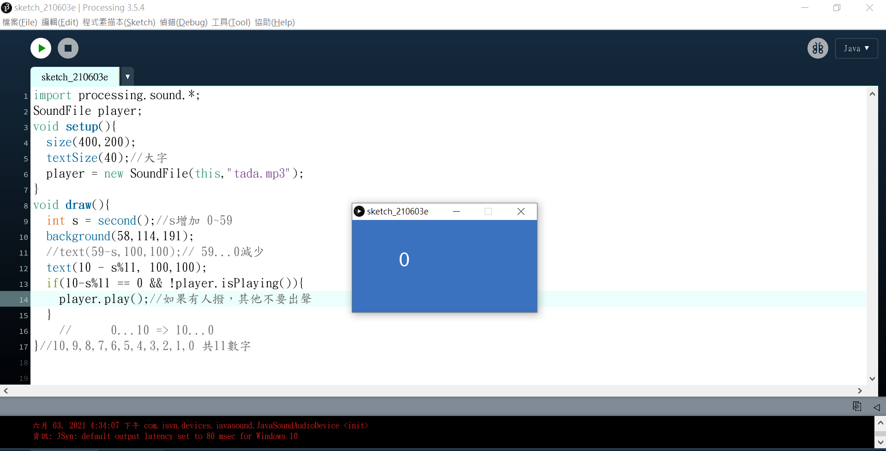
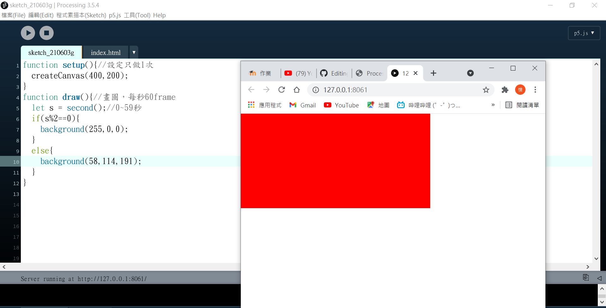
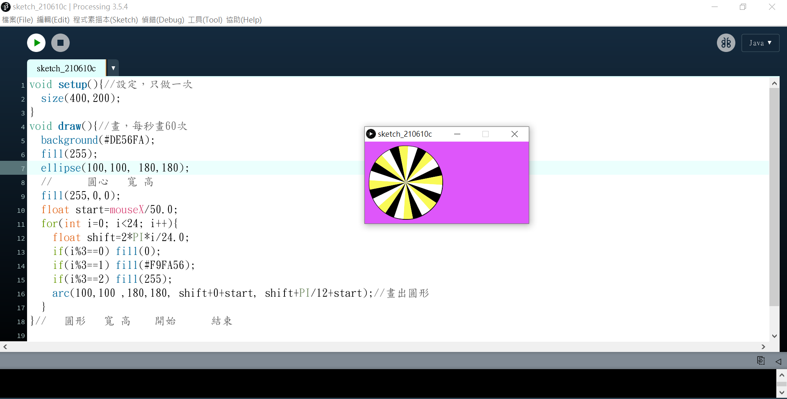

# 2020cce
## 第一週 實習課程式
### 第一題 基礎題：整數轉換為等級
```C
#include <stdio.h>
int main()
{
	int n;
	scanf("%d",&n);
	
	if(n>=90) printf("A\n");
	else if(n>=80) printf("B\n");
	else if(n>=60) printf("C\n");
	else printf("F\n");

}
```

### 第二題 基礎題：找倍數
```C
#include <stdio.h>
int main()
{
	int a[10],ans=0;
	
	for(int i=0; i<10; i++){
		scanf("%d",&a[i]);
		if( a[i]%3==0 ) ans++;
	}
	printf("%d\n",ans);
}
```

### 第三題 基礎題：因數個數
```C
#include <stdio.h>
int main()
{
	int a,n=0;
	scanf("%d",&a);
	
	for(int i=1; i<=10000; i++ ){
		if(a%i==0) n++;
	}
	printf("%d\n",n);
}
```

### 第四題 基礎題：找零錢
```C
#include <stdio.h>
int main()
{
	int a,b;
	scanf("%d",&a);
	
	printf("%d=50*%d+5*%d+1*%d\n",a,a/50,a%50/5,a%5);

}
```

### 第五題 進階題：漸增數列相加
```C
#include <stdio.h>
int main()
{
	int n,ans=0;
	scanf("%d",&n);
	
	for(int i=1; i<n; i++){
		ans+=i*(i+1);
	}
	printf("%d\n",ans);
}
```

### 第六題 進階題：A的B次方函數
```C
#include <stdio.h>
int MYPOWER(int a,int b)
{
	int n=1;
	for(int i=b; i>=1; i--){
		n=n*a;
	}
	return n;
}

int main(void)
{
	int a,b;
	scanf("%d%d",&a,&b);
	printf("[%d]",MYPOWER(a,b));
	return 0;
}
```

### 第七題 進階題：讀入整數反序列印
```C
#include <stdio.h>
int main()
{
	int a[10],n=0;
	
	for(int i=0; i<10; i++){
		scanf("%d",&a[i]);
		if(a[i]==0) break;
		n++;
	}
	
	for(int i=n-1; i>=0; i--){
		printf("%d ",a[i]);
	}
	printf("\n");
}
```

### 第八題 進階題：分式化簡
```C
#include <stdio.h>
int main()
{
	int a,b,n;
	scanf("%d%d",&a,&b);
	
	for(int i=1; i<10000; i++){
		if(a%i==0 && b%i==0) n=i;
	}
	
	printf("%d %d\n",a/n,b/n);
}
```


## 第二週 正課程式
### 第一題
```C
#include <stdio.h>
int main()
{
    int n1=10,n2=20,n3=30;
    printf("n1:%d n2:%d n3:%d\n",n1,n2,n3);

    int *p=&n1;
    *p=200;
    printf("n1:%d n2:%d n3:%d\n",n1,n2,n3);

    return 0;
}
```


### 第二題
```C
#include <stdio.h>
int main()
{
    int n1=10,n2=20,n3=30;
    printf("n1:%d n2:%d n3:%d\n",n1,n2,n3);

    int *p=&n1;
    *p=200;
    printf("n1:%d n2:%d n3:%d\n",n1,n2,n3);

    int *p2=&n3;
    *p2=300;
    printf("n1:%d n2:%d n3:%d\n",n1,n2,n3);

    return 0;
}
```


### 第三題
```C
int main()
{
    int n1=10,n2=20,n3=30;
    printf("n1:%d n2:%d n3:%d\n",n1,n2,n3);

    int *p=&n1;
    *p=200;
    printf("n1:%d n2:%d n3:%d\n",n1,n2,n3);

    int *p2=&n3;
    *p2=300;
    printf("n1:%d n2:%d n3:%d\n",n1,n2,n3);

    p2=p;
    *p2=400;
    printf("n1:%d n2:%d n3:%d\n",n1,n2,n3);
    return 0;
}
```


### 第四題
```C
#include <stdio.h>
int main()
{
    int n[3]={10,20,30};
    printf("n[0]:%d n[1]:%d n[2]:%d\n",n[0],n[1],n[2]);

    int *p=&n[0];
    *p=200;
    printf("n[0]:%d n[1]:%d n[2]:%d\n",n[0],n[1],n[2]);

    int *p2=&n[2];
    *p2=300;
    printf("n[0]:%d n[1]:%d n[2]:%d\n",n[0],n[1],n[2]);

    p2=p;
    *p2=400;
    printf("n[0]:%d n[1]:%d n[2]:%d\n",n[0],n[1],n[2]);

    return 0;
}
```


## 第三週 實習課程式
### 基礎題：計算幾週與幾天 
```C
#include <stdio.h>
int main()\
{
	int a,b,n;
	scanf("%d",&n);
	
	a=n/7;
	b=n%7;
	printf("%d %d\n",a,b);


}
```

### 基礎題：計程車資計算 
```C
#include <stdio.h>
int main()
{
	int a,ans=100;
	scanf("%d",&a);
	
	a=a-2000;
	ans+=a/500*5;
	if(a%500!=0) ans=ans+5;
	
	printf("%d\n",ans);
}

```

### 基礎題：兩數間可被5整除的整數 
```C
#include <stdio.h>
int main()
{
	int a,b;
	scanf("%d%d",&a,&b);
	
	if(b>a){
	for(int i=a; i<=b; i++){
		if(i%5==0) printf("%d\n",i);
	}
	}
	
	else if(a>b){
	for(int i=b; i<=a; i++){
		if(i%5==0) printf("%d\n",i);
	}
	}
	
}
```

### 基礎題：整數間最大距離
```C
#include <stdio.h>
int main()
{
	int a,b,c,ans;
	scanf("%d%d%d",&a,&b,&c);
	
	if(a>b){
		int temp=b;
			b=a;
			a=temp;
	}
	if(b>c){
		int temp=b;
			b=c;
			c=temp;
	}
	if(b<a){
		int temp=a;
			a=b;
			b=temp;
	}
	
	
	printf("%d\n",c-a);
}
```

### 進階題：大小寫轉換
```C
#include <stdio.h>
int main()
{
	char a[10];
	scanf("%s",&a);
	
	for(int i=0; a[i]!=0; i++){
		if(a[i]>='A'&& a[i]<='Z'){
			a[i]+=32;
			printf("%c",a[i]);
			
		}
		else if(a[i]>='a'&& a[i]<='z'){
			a[i]-=32;
			printf("%c",a[i]);
		}
		else printf("%c",a[i]);
	}
	printf("\n");
		
}
```

### 進階題：漸增數列相加  
```C
#include <stdio.h>
int main()
{
	int n,ans=0;
	scanf("%d",&n);
	
	for(int i=2; i<=n; i++){
		ans=ans+(i-1)*i;
	}
	printf("%d\n",ans);
}
```

### 進階題：計算陣列的平方值 
```C
#include <stdio.h>
int main()
{
	int n,a[10],c=0;
	scanf("%d",&n);
	for(int i=0; i<n;i++){
		scanf("%d",&a[i]);
		printf("%d,",a[i]*a[i]);
	}
	printf("\n");
}
```

### 進階題：2進位轉10進位
```C
#include <stdio.h>
int main()
{
	int n,a,b,c,d;
	scanf("%d",&n);
	
	a=n/1000;
	b=n%1000/100;
	c=n%1000%100/10;
	d=n%10;
	
	printf("%d\n",a*8+b*4+c*2+d*1);
}
```

## 第三週 正課程式
### 第一題
```C
#include <stdio.h>
int a[5]={0,10,20,30,40};
int main()
{
    int *p = &a[2];
    *p=222;
    
    p= p+2;
    *p=666;
    
    p--;
    *p=555;
    
}

```
### 第二題
```C
#include <stdio.h>
int a[5]={0,10,20,30,40};
void printfAll()
{
    for(int i=0; i<5; i++){
        printf("%d ",a[i]);
    }
    printf("\n");
}
int main()
{
    int *p = &a[2];
    *p=222;
    printfAll();

    p= p+2;
    *p=666;
    printfAll();

    p--;
    *p=555;
    printfAll();

}

```
### 第三題
```C
#include <stdio.h>
int a[10]={0,10,20,30,40,50,60,70,80,90};
void printfAll()
{
    for(int i=0; i<10; i++){
        printf("%3d ",a[i]);
    }
    printf("\n");
}
int main()
{
    int *p = &a[2];
    *p=222;
    printfAll();

    int *p2= p+4;
    *p2=666;
    printfAll();

    p2--;
    *p2=555;
    printfAll();

}
```

### 第四題
```C
#include <stdio.h>
#include <stdlib.h>

int a[10];
int main()
{
    int b[10];
    
    int *p=(int*) malloc( sizeof (int)*10);
    
    return 0;
}
```
## 第四週 實習課程式
### 基礎題：輸出從0到N的偶數
```C
#include <stdio.h>
int main()
{
	int n;
	scanf("%d",&n);
	
	for(int i=1; i<=n; i++){
		if(i%2==0) printf("%d ",i);
	}
	
}
```

### 基礎題：基礎題：數字之首
```C
#include <stdio.h>
int main()
{
	int n,a;
	scanf("%d",&n);
	if(n<100) a=n/10;
	else if(n<1000) a=n/100;
	else if(n<10000) a=n/1000;
	else if(n<100000) a=n/10000;
	printf("%d",a);
}
```

### 基礎題：基礎題：字元判別
```C
#include <stdio.h>
int main()
{
	char n;
	scanf("%c",&n);
	if(n>='A' && n<='Z') printf("U");
	else if(n>='a' && n<='z') printf("L");
	else if(n>='0' && n<='9') printf("D");
	else printf("O");
}
```

### 基礎題：分開整數的每個數字
```C
#include <stdio.h>
int main()
{
	int n;
	scanf("%d",&n);
	
	int a=n/10000;
	int b=n%10000/1000;
	int c=n%1000/100;
	int d=n%100/10;
	int e=n%10;
	
	printf("%d   %d   %d   %d   %d",a,b,c,d,e);
}
```

### 進階題：星星等腰三角
```C
#include <stdio.h>
int main()
{
	int n;
	scanf("%d",&n);
	
	for(int i=1; i<=n; i++){
		int space=n-i;
		for(int k=1; k<=space; k++){
			printf(" ");
		}
		
		int star=2*i-1;
		for(int k=1; k<=star; k++){
		printf("*");
		}
		printf("\n");
	}
}
```

### 進階題:函數找整數的最大數字
```C
#include <stdio.h>

int max_digit(int a){
	int x,y=0;
	for(int i=1; a>1; i++){
		x=a%10;
		a=a/10;
		if(x>y) y=x;
	
	}
	return y;
}

int main(void){
  int n;
  scanf("%d", &n);
  printf("[%d]", max_digit(n));
  return 0;
}
```

### 進階題：擲骰統計
```C
#include <stdio.h>
int main()
{
	char s[100],a=0,b=0,c=0,d=0,e=0,f=0;
	scanf("%s",&s);
	for(int i=0; s[i]!='\0'; i++){
		if     (s[i]=='1') a++;
		else if(s[i]=='2') b++;
		else if(s[i]=='3') c++;
		else if(s[i]=='4') d++;
		else if(s[i]=='5') e++;
		else if(s[i]=='6') f++;
	}
	printf("1:%d\n2:%d\n3:%d\n4:%d\n5:%d\n6:%d\n",a,b,c,d,e,f);
}
```

### 進階題：除惡務盡
```C
#include <stdio.h>
int main()
{
	char n[100];
	scanf("%s",&n);
	for(int i=0; n[i]!=0; i++){
		
		if(n[i]!='2') printf("%c",n[i]);
	}
	printf("\n");
	
	
}
```


## 第四週 正課程式
### 第一題
```C
#include <stdio.h>
struct DATA{///宣告
    float x,y,z;///定義裡面有...
} point1 ;

int main()
{

}
```

### 第二題
```C
#include <stdio.h>
struct DATA{///宣告
    float x,y,z;///定義裡面有...
} point1 ;

///point1 是變數，長得像DATA
///DATA裡面有 x,y,z

int main()
{   
    point1.x=3;///使用(裡面的值)
    point1.y=5;///使用
    point1.z=7;///使用
    printf("%f %f %f\n",point1.x,point1.y,point1.z);
    
}
```

### 第三題
```C
#include <stdio.h>
struct DATA{///宣告
    float x,y,z;///定義裡面有...
} point1 ;
struct DATA points[5];

///point1 是變數，長得像DATA
///DATA裡面有 x,y,z

int main()
{
    ///int b;
    ///int a[5];
    for(int i=0; i<5; i++){
        points[i].x=i*10;
        points[i].y=20;
        points[i].z=0;
        printf("%f %f %f\n",points[i].x,points[i].y,points[i].z);
    }
}
```

### 第四題
```C
#include <stdio.h>
struct DATA{
    float x, y, z;
} a, b, c;
struct DATA points[5];

int main()
{
    struct DATA d, e, f;

    for(int i=0; i<5; i++){
        points[i].x=i*10;
        points[i].y=20;
        points[i].z=0;
        printf("%f %f %f\n",points[i].x,points[i].y,points[i].z);
    }
}
```

### 第五題
```C
#include <stdio.h>
struct DATA{
    float x, y, z;
} a, b;
struct DATA c,d;

int main()
{
    struct DATA e;
    struct DATA f={1, 2, 3};///宣告的同時，可以初始值


    printf("%f %f %f\n", a.x, a.y, a.z);
    printf("%f %f %f\n", b.x, b.y, b.z);
    printf("%f %f %f\n", c.x, c.y, c.z);
    printf("%f %f %f\n", d.x, d.y, d.z);
    printf("%f %f %f\n", e.x, e.y, e.z);
    printf("%f %f %f\n", f.x, f.y, f.z);

}
```


## 第五週 實習課程式
### 基礎題:計算商數 
```C
#include <stdio.h>
int main()
{
	int a,b;
	scanf("%d%d",&a,&b);
	
	printf("%d\n",a/b);

}
```
### 基礎題:三數極大
```C
#include <stdio.h>
int main()
{
	int a,b,c;
	scanf("%d%d%d",&a,&b,&c);
	
	if(a>b){
		int temp=a;
		a=b;
		b=temp;
	}
	if(b>c){
		int temp=b;
		b=c;
		c=temp;
	}
	if(a>c){
		int temp=c;
		a=c;
		c=temp;
	}
	printf("%d\n",c);

}
```
### 基礎題:N數之和
```C
#include <stdio.h>
int main()
{
	int n,a,ans=0;
	scanf("%d",&n);
	
	for(int i=1; i<=n; i++){
		scanf("%d",&a);
		ans=ans+a;
	}
	printf("%d\n",ans);
}
```
### 進階題:絕對值函數 
```C
#include <stdio.h>
int f(int n)
{
	int a;
	if(n<1) a=n*(-1);
	else if(n>1) a=a;
	return a;
}

int main(void)
{
	int n;
	scanf("%d",&n);
	printf("[%d]",f(n));
	return 0;
}
```
### 進階題:反序數字 
```C
#include <stdio.h>
int main()
{
	int a,b;
	scanf("%d",&a);
	
	if(a<100)
	b=a/10+a%10*10;
	
	else if(a<1000)
	b=a/100+a%100/10*10+a%10*100;
	
	else if(a<10000)
	b=a/1000+a%1000/100*10+a%100/10*100+a%10*1000;
	
	printf("%d+%d=%d\n",a,b,a+b);

}

```
## 第五週 正課程式
### 第一題
```C
#include <stdio.h>
char line[20]="233233233233233233";
int main()
{
    char *p = line;
    ///scanf("%s",line);
    for(int i=0; line[i]!=0; i++){
        p = &line[i];
        char c = line[i];
        if(c!='2') printf("%c",c);
    }
    printf("\n");
}
```

### 第二題
```C
#include <stdio.h>
int main()
{
    char line[10]= "decline";
    char line2[10]= {'p','r','o','p','e','r','\0'};

    printf("%s\n",line);
    printf("%s\n",line2);
}
```

### 第三題
```C
#include <stdio.h>
int main()
{
    char line[10]= "decline";
    char line2[10]= {'p','r','o','p','e','r','\0'};

    printf("%s\n",line);
    printf("%s\n",line2);

    char line3[]="majority這是好的，沒問題，要多長有多長";
    char line4[]={'m','a','j','o','r','i','t','y'};
    printf("%s\n",line3);

    printf("你相信嗎? 這是 line4:==%s==\n", line4 );

}
```

### 第四題
```C
#include <stdio.h>
int main()
{
    char line[5][10]= {"decline","proper","majority","bullet","shop"};
    //char *p;
    for(int i=0; i<5; i++){
        //p = &line[i];
        printf("%s\n",line[i]);
    }


}
```

### 第五題
```C
#include <stdio.h>
int a[3][3]={ {1,2,3}, {4,5,6}, {7,8,9} };
int main()
{
    for(int i=0; i<3; i++){
        for(int j=0; j<3; j++){
            printf("%d ",a[i][j]);

        }
        printf("\n");
    }
}
```

## 第六週 實習課程式
### 基礎題：整數轉換等級
```C
#include <stdio.h>
int main()
{
	int n;
	scanf("%d",&n);
	
	if(n>=90) printf("A");
	else if(n>=80) printf("B");
	else if(n>=70) printf("C");
	else if(n>=60) printf("D");
	else printf("F");
}
```
### 基礎題：計算餘數
```C
#include <stdio.h>
int main()
{
	int a,b;
	scanf("%d%d",&a,&b);

	printf("%d",a%b);
}
```
### 基礎題：計程車資計算 
```C
#include <stdio.h>
int main()
{
	int n,ans=100;
	scanf("%d",&n);
	
	if(n<1500) printf("%d",ans);
	else if(n>1500){ 
		n=n-1500;
		ans+=n/250*5;
	
		if(n%250!=0) ans=ans+5;
	}
	printf("%d",ans);
	

}

```
### 基礎題：找零錢
```C
#include <stdio.h>
int main()
{
	int n,a,b,c,d;
	scanf("%d",&n);
	
	a=n/50;
	b=n%50/10;
	c=n%10/5;
	d=n%5;
	
	printf("%d=50*%d+10*%d+5*%d+1*%d",n,a,b,c,d);

}
```
### 進階題：計算一列整數的總和
```C
#include <stdio.h>
int main()
{
	int a[100],n=0,ans=0;
	
	for(int i=0; i<100; i++){
		scanf("%d",&a[i]);
		if(a[i]==999) break;
		n++;
	}
	
	for(int i=0; i<n; i++){
		printf("Enter an integer ( 999 to end ): \n");
		ans=ans+a[i];
	}
	
	printf("Enter an integer ( 999 to end ): \n");
	printf("The total is: %d",ans);
}
```
### 進階題：判斷大小
```C
#include <stdio.h>
int f(int a,int b){
	int n;
	if(a<b) n=-1;
	else if(a==b) n=0;
	else n=1;
	return n; 
}

int main(){
    int a, b;
    scanf("%d %d", &a, &b);
    printf("%d",f(a,b));
    return 0;
}

```

### 進階題：陣列找出現次數 
```C
#include <stdio.h>
int main()
{
	int a[10],b=0,n,ans=0;
	for(int i=0; i<10; i++){
		scanf("%d",&a[i]);
		if(a[i]==0) break;
		b++;
	}
	
	scanf("%d",&n);
	for(int i=0; i<b; i++){
		if(a[i]==n) ans++;
	}
	
	printf("%d\n",ans);
}
```

### 進階題：函數反序排列數字 
```C
#include <stdio.h>
int f(int n)
{
	int a;
	if(n>=1000) a=a/1000 +a%1000/100*10 +a%100/10*100 +a%10*1000;
	else if(n>=100) a=a/100 +a%100/10*10 +a%10*100;
	else if(n>=10) a=n/10 +n%10*10;
	else a=n;
	return a;
}
int main()
{
	int n;
	scanf("%d",&n);
	printf("%d\n",f(n));
	return 0;
}
```

## 第七週 正課程式
### 第一題
```C
#include <stdio.h>
#include <string.h>
#include <stdlib.h>

char a[100][10];
int compare( const void *p1, const void *p2)
{
	char *s1 = (char*)p1;
	char *s2 = (char*)p2;
	return strcmp( s1, s2 );
}


int main()
{
	int n;
	scanf("%d",&n);

	for(int i=0; i<n; i++){
		scanf("%s",a[i]);
	}

	qsort(   a,    n,      10,        compare);
//快速排列(     陣列,  n個,  每個有多大,  比較的函式)

	for(int i=0; i<n; i++){
		printf("%s\n",a[i]);
	}

}

```
### 第二題
```C
#include <stdio.h>
#include <string.h>
int main()
{
	int n,ans=1;
	scanf("%d",&n);
	
	char a[2000][75];
	char temp[75];
	char others[100];
	
	for(int i=0; i<n; i++){
		scanf("%s",a[i]);
		gets(others);
	}
	
	for(int i=0; i<n; i++){
		for(int j=i+1; j<n; j++){
			if( strcmp(a[i],a[j]) > 0 ){
				strcpy(temp,a[i]);
				strcpy(a[i],a[j]);
				strcpy(a[j],temp);
			}
		}
	}
	for(int i=0; i<n; i++){
		if(strcmp(a[i],a[i+1]) == 0 ){
			ans++;
		}
		else{
			printf("%s %d\n",a[i],ans);
			ans=1;
		}
	}

}
```
## 第八週正課
### 字串排序.1
```C
#include <stdio.h>
#include <string.h>
#include <stdlib.h>
char line[100][10];
int compare( const void *p1, const void *p2){
	return strcmp((char*)p1,(char*)p2);
}
int main()
{
	int N;
	scanf("%d",&N);
	
	for(int i=0; i<N; i++){
		scanf("%s",line[i]);
	}
	qsort( line, N, 10, compare);
	for(int i=0; i<N; i++){
		printf("%s\n",line[i]);
	}
}
```

### 字串排序.2
```C
#include <stdio.h>
#include <string.h>
#include <stdlib.h>
char name[2000][80];
char others[80];

int compare(const void *p1, const void *p2){
	return strcmp((char*)p1,(char*)p2);
}

int main()
{
	int n;
	scanf("%d",&n);
	for(int i=0; i<n; i++){
		scanf("%s",name[i]);
		gets(others);
	}	

	qsort(name, n, 80, compare);
	
	int ans=1;
	printf("%s ",name[0]);
	for(int i=0; i<n-1; i++){
		if(strcmp(name[i],name[i+1]) != 0){
			printf("%d\n",ans);
			printf("%s ",name[i+1]);
			ans=1;
		}
		else{
			ans++;
		}
	}
	printf("%d\n",ans);
}
```

### 字串排序.3
```C
#include <string.h>
#include <stdlib.h>
char tree[100000][32];
int compare( const void *p1,const void*p2)
{
	return strcmp((char*)p1, (char*)p2);
}
int main()
{
	int T;
	scanf("%d\n\n",&T);

	for(int t=0; t<T; t++){
		int N=0;//有幾行讀進來?
		for(int i=0;   ; i++){
			gets( tree[i] );
			if( strcmp(tree[i],"") ==0 ){
				N=i;//要記錄現在的i
				break;//就可以離開了
			}
		}
		
		qsort(tree, N, 32, compare);
		
		int ans=1;
		printf("%s ",tree[0]);
		for(int i=0; i<N-1; i++){
			if( strcmp(tree[i],tree[i+1]) != 0 ){
				printf("%.4f\n",100*ans/(float)N);
				printf("%s ",tree[i+1]);
				ans=1;
			}
			else{
				ans++;
			}
		}
		printf("%.4f\n",100*ans/(float)N);
	}
	
}
```

## 字串排序.4
```C
#include <stdio.h>
#include <string.h>
#include <stdlib.h>
char tree[100000][32];
int compare( const void *p1,const void*p2)
{
	return strcmp((char*)p1, (char*)p2);
}
int main()
{
	int T;
	scanf("%d\n\n",&T);

	for(int t=0; t<T; t++){
		int N=0;//有幾行讀進來?
		for(int i=0;   ; i++){
			gets( tree[i] );
			if( strcmp(tree[i],"") ==0 ){
				N=i;//要記錄現在的i
				break;//就可以離開了
			}
		}
		
		qsort(tree, N, 32, compare);
		
		int ans=1;
		printf("%s ",tree[0]);
		for(int i=0; i<N-1; i++){
			if( strcmp(tree[i],tree[i+1]) != 0 ){
				printf("%.4f\n",100*ans/(float)N);
				printf("%s ",tree[i+1]);
				ans=1;
			}
			else{
				ans++;
			}
			memset(tree[i], '\0', 32);
		}
		printf("%.4f\n",100*ans/(float)N);
		if(t!=(T-1)) printf("\n");
	}
	
}
```
## 第十週 實習課程式
### 基礎題：平年月份的天數
```C
#include <stdio.h>
int main()
{
	int n;
	scanf("%d",&n);
	
	if(n==1) printf("31");
	else if(n==2) printf("28");
	else if(n==3) printf("31");
	else if(n==4) printf("30");
	else if(n==5) printf("31");
	else if(n==6) printf("30");
	else if(n==7) printf("31");
	else if(n==8) printf("31");
	else if(n==9) printf("30");
	else if(n==10) printf("31");
	else if(n==11) printf("30");
	else if(n==12) printf("31");

}
```
### 基礎題：將一連串整數相乘
```C
#include <stdio.h>
int main()
{
	int n,ans=1,a;
	scanf("%d",&n);
	printf("Enter the number of values to be processed: ");
	
	for(int i=0; i<n; i++){
		scanf("%d",&a);
		printf("Enter a value: ");
		ans=ans*a;
	}
	
	printf("Product of the %d values is %d",n,ans);
}
```
### 基礎題：判別正方形
```C
#include <stdio.h>
int main()
{
	int a,b;
	printf("Enter two numbers:  ");
	scanf("%d%d",&a,&b);
	
	if(a==b) printf("It is a square ");
	else if( a>b || a<b ) printf("It is not a square ");

}
```
### 基礎題：計算餘數及列印 
```C
#include <stdio.h>
int main()
{
	int x,y;
	printf("Enter two numbers: ");
	scanf("%d%d",&x,&y);
	
	printf("The remainder is %d\n",x%y);

}
```
### 進階題：判斷迴文
```C
#include <stdio.h>
#include <string.h>

int main()
{
	char n[81];
	int a=0;
	scanf("%s",n);
	
	//strlen(n)==10
	for(int i=0; i<strlen(n); i++){
		if(n[i]!=n[strlen(n)-1-i]){
			a=1;
			printf("NO");
			break;
		}
	}
	if(a==0) printf("YES");
	

}
```
### 進階題：函數判斷質數
```C
#include <iostream>
using namespace std;
int prime(int n)
{
	int a;
	for(int i=2; i<n; i++){
		if(n%i==0){ 
			a=0;
			break;
		}
		else a=1;
	}
	return a;

}
	
int main(){
  int n;cin>>n;
  cout<<"["<<prime(n)<<"]";
  return 0;
}
```
### 進階題：字串長度
```C
#include <stdio.h>
#include <string.h>

int main()
{
	char a[100],b[100],x,y;
	scanf("%s%s",a,b);
	
	
	
	if(strlen(a)>strlen(b)) printf("1");
	else if(strlen(a)<strlen(b)) printf("-1");
	else printf("%d",strcmp(a,b));
}
```
### 進階題：最大公因數gcd 
```C
#include <stdio.h>
int main()
{
	int a,b,n;
	printf("Enter two integers: \n");
	scanf("%d%d",&a,&b);
	
	for(int i=1; i<=b; i++){
		if(a%i==0 && b%i==0) n=i;
	}
	
	printf("The greatest common divisor of %d and %d is %d\n",a,b,n);

}
```
## 第十週 正課程式
### UVA 10008(1)
```C
#include <stdio.h>
char line[10000];
char ans[26];
char alphabet[]="ABCDEFGHIJKLMNOPQRSTUVWXYZ";
int main()
{
	int n;
	scanf("%d\n",&n);
	
	for(int i=0; i<n; i++){
		gets(line);
		for(int k=0; line[k]!=0; k++){
			char c= line[k];
			if(c>='A' && c<='Z') ans[ c-'A' ]++;
			else if(c>='a' && c<='z') ans[ c-'a' ]++; 
		}
	}
	
	for(int i=0; i<26; i++){
		for(int j=i+1; j<26; j++){
			if( ans[i]<ans[j] || (ans[i]==ans[j] && alphabet[i]>alphabet[j]) ){
				int temp=ans[i];
				ans[i]=ans[j];
				ans[j]=temp;
				char c = alphabet[i];
				alphabet[i] = alphabet[j];
				alphabet[j] = c;
			}
		}
	}
	
	for(int i=0; i<26; i++){
		if(ans[i]>0) printf("%c %d\n", alphabet[i], ans[i]);
	}
}
```
.PNG)

### UVA 10008(2)
```C
#include <stdio.h>
#include <stdlib.h>
char line[10000];

typedef struct{
	int ans;//char ans[26];
	char c;//char alphabet[]="ABCDEFGHIJKLMNOPQRSTUVWXYZ";
}BOX;
BOX array[26];

int compare(const void *p1, const void *p2){
	if(((BOX*)p1)->ans > ((BOX*)p2)->ans) return -1;
	else if(((BOX*)p1)->ans < ((BOX*)p2)->ans) return +1;
	else if(((BOX*)p1)->c < ((BOX*)p2)->c) return -1;
	else if(((BOX*)p1)->c > ((BOX*)p2)->c) return +1;
	else return 0;
}
int main()
{
	for(int i=0; i<26; i++) array[i].c = 'A'+i;
	int n;
	scanf("%d\n",&n);
	
	for(int i=0; i<n; i++){
		gets(line);
		for(int k=0; line[k]!=0; k++){
			char c= line[k];
			if(c>='A' && c<='Z') array[ c-'A' ].ans++;
			else if(c>='a' && c<='z') array[ c-'a' ].ans++; 
		}
	}
	
	qsort(array, 26, sizeof(BOX), compare);
	
	for(int i=0; i<26; i++){
		if(array[i].ans>0) printf("%c %d\n", array[i].c, array[i].ans);
	}
}
```
.PNG)
## 第十一週 實習課程式
### 基礎題：兩數平方差
```C
#include <stdio.h>
int main()
{
	int a,b,ans;
	scanf("%d%d",&a,&b);
	
	ans=(a*a)-(b*b);
	printf("%d",ans);

}
```
### 基礎題：零錢總額
```C
#include <stdio.h>
int main()
{
	int a,b,c,ans;
	scanf("%d%d%d",&a,&b,&c);
	
	ans=a*50+b*5+c*1;
	printf("%d",ans);
}
```
### 基礎題：幾日為星期幾
```C
#include <stdio.h>
int main()
{
	int n;
	scanf("%d",&n);
	
	if(n%7==1) printf("0");
	else if(n%7==2) printf("1");
	else if(n%7==3) printf("2");
	else if(n%7==4) printf("3");
	else if(n%7==5) printf("4");
	else if(n%7==6) printf("5");
	else if(n%7==0) printf("6");

}
```
### 基礎題：整數二元四則運算
```C
#include <stdio.h>
int main()
{
	int a,b;
	char n;
	scanf("%d ",&a);
	scanf("%c ",&n);
	scanf("%d",&b);
	
	if(n=='+') 	printf("%d",a+b);
	else if(n=='-') printf("%d",a-b);
	else if(n=='*') printf("%d",a*b);
	else if(n=='/') printf("%d",a/b);
	
	
}
```
### 進階題：兩數間可被7整除的數
```C
#include <stdio.h>
int main()
{
	int a,b;
	scanf("%d%d",&a,&b);
	
	if(a<b){
		for(int i=a; i<b; i++){
			if(i%7==0) printf("%d ",i);
		}
	}
	else if(a>b){
		for(int i=b; i<a; i++){
			if(i%7==0) printf("%d ",i);
		}
	}
}
```
### 進階題：奇數之和
```C
#include <stdio.h>
int main()
{
	int n,ans=0;
	scanf("%d",&n);
	
	if(n%2!=0){
		for(int i=1; i<=n; i+=2){
			ans=ans+i;
		}
	}
	
	else if(n%2==0){
		for(int i=1; i<n; i+=2){
			ans=ans+i;
		}
	}
	
	printf("%d",ans);

}
```
### 進階題：利用自訂函式最大值max與最小值min求出兩者之差
```C
#include<iostream>
using namespace std;
int max(int a,int b,int c,int d)
{
	if(a>b){
		int temp=a;
			a=b;
			b=temp;
	}
	if(b>c){
		int temp=b;
			b=c;
			c=temp;
	}
	if(c>d){
		int temp=c;
			c=d;
			d=temp;
	}
	if(a>d){
		int temp=a;
			a=d;
			d=temp;
	}
	return d;
}
int min(int a,int b,int c,int d){
	if(a<b){
		int temp=a;
		a=b;
		b=temp;
	}
	if(b<c){
		int temp=b;
			b=c;
			c=temp;
	}
	if(c<d){
		int temp=c;
			c=d;
			d=temp;
	}
	if(a<d){
		int temp=a;
			a=d;
			d=temp;
	}
	return d;
}
int main(){
  int a,b,c,d;cin>>a>>b>>c>>d;
  cout<<(max(a,b,c,d)-min(a,b,c,d));
  return 0;
}

```
### 進階題：字串中的數字個數
```C
#include <stdio.h>
int main()
{
	int n=0;
	char a[81];
	scanf("%s",a);
	
	for(int i=0; a[i];i++){
		if(a[i]>='0' && a[i]<='9') n++;
	}
	printf("%d",n);
}
```
## 第十一週 正課程式
### 第一題
```C
#include <stdio.h>
unsigned char c;
typedef unsigned char uchar;
uchar d;
int main()
{
    c ='A';
    d = c;
    printf("%c",d);
}
```
### 第二題
```C
#include <stdio.h>
typedef struct data{
    char c;
    int ans;
}DATA;
///struct data listA;
DATA listA;

int main()
{
    listA.c = 'A';
    listA.ans = 1;

    printf("%c %d\n", listA.c, listA.ans);
}
```
### 第三題
```C
#include <stdio.h>
#include <stdlib.h>
int compare(const void *p1, const void *p2)
{   ///轉成｢整數的指標｣ / 望遠鏡，準星看到的整數
    int d1 = *( (int*)p1 );
    int d2 = *( (int*)p2 );
    if(d1>d2) return 1;
    if(d1==d2) return 0;
    if(d1<d2) return -1;
}

int a[10]={4,8,3,7,5,2,9,1,6,10};
int main()
{
    qsort( a, 10, sizeof(int), compare);
    for(int i=0; i<10; i++){
        printf("%d ",a[i]);
    }
}
```
### 第四題
```C
#include <stdio.h>
#include <stdlib.h> //qsort()
#include <string.h> //strcmp()
char name[2000][80];
char others[80];
int compare( const void *p1, const void *p2 )
{
	char *s1 = (char*)p1;
	char *s2 = (char*)p2;
	if( strcmp(s1,s2) > 0 ) return 1;
	if( strcmp(s1,s2) ==0 ) return 0;
	if( strcmp(s1,s2) < 0 ) return -1;
	//return strcmp( s1, s2 );
	//return strcmp( (char*)p1,(char*)p2 );

}
int main()
{
	int N;
	scanf("%d", &N);
	for(int i=0; i<N; i++){
		scanf("%s", name[i] );
		gets( others );
	}
	
	qsort( name, N, 80, compare );
	
	printf("%s ", name[0] );//開頭
	int ans=1;
	
	for(int i=0; i<N-1; i++){
		if( strcmp( name[i], name[i+1] ) == 0 ){
			ans++;
		}else{
			printf("%d\n", ans );//結尾		
			printf("%s ", name[i+1] );//新的開頭
			ans=1;
		}
	}
	printf("%d\n", ans );//結尾
}
```
## 第十二週 實習課程式
### 基礎題：找千位數
```C
#include <stdio.h>
int main()
{
	int n;
	scanf("%d",&n);

	if(n>=1000 && n<10000) printf("%d",n/1000);
	else if(n>=10000 && n<100000) printf("%d",(n/1000)%10);
	else if(n>=100000 && n<1000000) printf("%d",(n/1000)%10);
	else printf("0");
}
```

### 基礎題：計算立方值
```C
#include <stdio.h>
int ANS(int n)
{
	int a;
	a=n*n*n;
	return a;
}
int main()
{
	int n;
	for(int i=1; i<=6; i++){
		scanf("%d ",&n);
		printf("%d\n",ANS(n));
	}
}
```

### 基礎題：三數最小 
```C
#include <stdio.h>
int MIN(int a,int b,int c)
{
	if(a>b){
		int temp=a;
		    a=b;
		    b=temp;
	}
	if(b>c){
		int temp=b;
		    b=c;
		    c=temp;
	}
	if(a>c){
		int temp=a;
		    a=c;
		    c=temp;
	}
	if(a>b){
		int temp=a;
		    a=b;
		    b=temp;
	}
	return a;
}
int main()
{
	int a,b,c;
	scanf("%d%d%d",&a,&b,&c);
	printf("%d\n",MIN(a,b,c));
}
```

### 基礎題：剩餘啤酒有幾手又幾瓶
```C
#include <stdio.h>
int main()
{
	int p,d,n;
	scanf("%d%d",&p,&d);

	n = p-(d*6);

	printf("%d %d",n/6,n%6);
}
```

### 進階題：三數組合
```C
#include <stdio.h>
int main()
{
	int a,b,c,n;
	scanf("%d%d%d",&a,&b,&c);
	if(c>b){
		int temp=c;
			c=b;
			b=temp;
	}
	if(b>a){
		int temp=b;
			b=a;
			a=temp;
	}
	if(c>a){
		int temp=c;
			c=a;
			a=temp;
	}
	if(c>b){
		int temp=c;
			c=b;
			b=temp;
	}
	n = a*100+b*10+c;
	printf("%d",n+1);
}
```

### 進階題：計算質數個數
```C
#include <stdio.h>
int main()
{
	int a,b,n=0,ans=0;
	scanf("%d%d",&a,&b);

		for(int i=a; i<=b; i++){
			for(int j=2; j<i; j++){
				if(i%j==0) n++;
			}
			if(n==0)ans++;
			n=0;
		}

	printf("%d",ans);
}
```

### 進階題：判斷平方數
```C
#include <stdio.h>
int main()
{
	int n,a=0;
	scanf("%d",&n);

	for(int i=2; i<n; i++){
		if( i*i==n && n%i==0 ){
			printf("%d",i);
			a=i;
			break;
		}
	}
	if(a==0) printf("0");

}
```

### 進階題：數字個數
```C
#include <stdio.h>
int main()
{
	int n,ans=0;

	for(int i=1; i<=10; i++){
		scanf("%d",&n);
		if(n!=0) ans++;
	}
	printf("%d",ans);
}
```

## 第十二週 正課程式
### UVA 10062
```C
#include <stdio.h>
char line[2000];
int main()
{
	for(int t=0; gets(line); t++){
		int ans[256]={};
		char ascii[256];
		
		for(int i=0; i<256; i++) ascii[i]=i;
		
		for(int i=0; line[i]!=0; i++){
			char c = line[i];
			ans[c]++;
		}
		for(int i=0; i<256; i++){
			for(int j=i+1; j<256; j++){
				if(ans[i]>ans[j]){
					int temp=ans[i];
						ans[i]=ans[j];
						ans[j]=temp;
					char c=ascii[i];
						 ascii[i]=ascii[j];
						 ascii[j]=c;	
				}
				else if( ans[i]==ans[j] && ascii[i]<ascii[j]){
					int temp=ans[i];
						ans[i]=ans[j];
						ans[j]=temp;
					char c=ascii[i];
						 ascii[i]=ascii[j];
						 ascii[j]=c;	
				}
			}
		}
		if(t>0) printf("\n");
		
		for(int i=0; i<256; i++){
			if(ans[i]>0) printf("%d %d\n",ascii[i] ,ans[i]);
		}
	}

}
```

### UVA 299
```C
#include <stdio.h>
int a[100];
int main()
{
	int T;
	scanf("%d",&T);
	
	for(int t=0; t<T; t++){
		int N;
		scanf("%d",&N);
		
		for(int i=0; i<N; i++){
			scanf("%d",&a[i]);
		}
		
		int ans=0;
		
		for(int k=0; k<N-1; k++){
			for(int i=0; i<N-1; i++){
				if( a[i] > a[i+1]){
					int temp=a[i];
						a[i]=a[i+1];
						a[i+1]=temp;
						ans++;
				}
			}
		}
		
		printf("Optimal train swapping takes %d swaps.\n",ans);
	}

}
```

### UVA 10321
```C
#include <stdio.h>
int a[10001];
int main()
{
	int N,M;
	while(scanf("%d %d",&N,&M)==2)
	{
		for(int i=0; i<N; i++){
			scanf("%d",&a[i]);
		}

		for(int i=0; i<N; i++)
			for(int j=i+1; j<N; j++){
				if(a[i]%M>a[j]%M){
					int temp=a[i];
						a[i]=a[j];
						a[j]=temp;
				}
				else if(a[i]%M==a[j]%M && a[i]%2==0 && a[j]%2){
					int temp=a[i];
						a[i]=a[j];
						a[j]=temp;
				}
				else if(a[i]%M==a[j]%M && a[i]%2 && a[j]%2 && a[i]<a[j]){
					int temp=a[i];
						a[i]=a[j];
						a[j]=temp;
				}
				else if(a[i]%M==a[j]%M && a[i]%2==0 && a[j]%2==0 && a[i]>a[j]){
					int temp=a[i];
						a[i]=a[j];
						a[j]=temp;
				}
			}
		printf("%d %d\n",N,M);
		for(int i=0; i<N; i++){
			printf("%d\n",a[i]);
		}
	}
}
```

### UVA 10321(2)
```C
#include <stdio.h>
int a[10001];
void swap(int i,int j)
{
			int temp=a[i];
			a[i]=a[j];
			a[j]=temp;
}
int main()
{
	int N,M;
	while(scanf("%d %d",&N,&M)==2)
	{
		for(int i=0; i<N; i++){
			scanf("%d",&a[i]);
		}

		for(int i=0; i<N; i++)
			for(int j=i+1; j<N; j++){
				if(a[i]%M>a[j]%M) swap(i,j);
				if(a[i]%M==a[j]%M && a[i]%2==0 && a[j]%2!=0) swap(i,j);
				if(a[i]%M==a[j]%M && a[i]%2 && a[j]%2!=0 && a[i]<a[j]) swap(i,j);
				if(a[i]%M==a[j]%M && a[i]%2==0 && a[j]%2==0 && a[i]>a[j]) swap(i,j);
			}
		printf("%d %d\n",N,M);
		for(int i=0; i<N; i++){
			printf("%d\n",a[i]);
		}
	}
}
```
.PNG)
## 第十三週 實習課程式
### 基礎題：輸入n (n>0)， 求n之所有因數和
```C
#include <stdio.h>
int main()
{
	int n,ans=0;
	scanf("%d",&n);
	
	for(int i=1; i<=n; i++){
		if(n%i==0) ans+=i;
	}
	
	printf("%d",ans);
}
```
### 基礎題：判斷座標的象限
```C
#include <stdio.h>
int main()
{
	int x,y;
	scanf("%d%d",&x,&y);
	
	if(x>0 && y>0) printf("1\n");
	else if(x<0 && y>0) printf("2\n");
	else if(x<0 && y<0) printf("3\n");
	else if(x>0 && y<0) printf("4\n");

}
```
### 基礎題：正整數平方總和
```C
#include <stdio.h>
int main()
{
	int n,ans=0;
	scanf("%d",&n);
	
	for(int i=1; i<=n; i++){
		ans=ans+(i*i);
	}
	printf("%d",ans);
}
```
### 進階題：兩數之間的3倍數總和
```C
#include <stdio.h>
int main()
{
	int a,b,ans=0;
	scanf("%d%d",&a,&b);
	
	if(a<b){
		for(int i=a; i<=b; i++){
			if(i%3==0) ans+=i;
		}
	}
	else if(a>b){
		for(int i=b; i<=a; i++){
			if(i%3==0) ans+=i;
		}
	}
	printf("%d",ans);
}
```
### 進階題：10數排序，從大到小排好
```C
#include <stdio.h>
int main()
{
	int a[10];
	for(int i=0; i<10; i++){
		scanf("%d",&a[i]);
	}
	
	for(int i=0; i<10; i++){
		for(int j=i+1; j<10; j++){
			if(a[i]<a[j]){
				int temp=a[i];
					a[i]=a[j];
					a[j]=temp;
			}
		}
	}
	for(int i=0; i<10; i++){
		printf("%d ",a[i]);
	}
}
```
### 進階題：區間測速-超速之王
```C
#include <stdio.h>
int main()
{
	int n,a=999999,b,time=3600*1.2;
	for(int i=0; i<10; i++){
		scanf("%d",&n);
		if(n<a){
			a=n;
			b=i+1;
		}
	}
	printf("%d %d",b,time/a);
}
```
### 進階題：求兩數之最大公因數
```C
#include<iostream>
using namespace std;
int GCD(int a, int b){
	int n=0;
	if(a<b){
		for(int i=2; i<=b; i++){
			if(a%i==0 && b%i==0) n=i;
		}
		if(n==0) n=1;
	}
	else if(a>b){
		for(int i=2; i<=a; i++){
			if(a%i==0 && b%i==0) n=i;
		}
		if(n==0) n=1;
	}
	return n;
}
int main(){
  int a,b;cin>>a>>b;
  cout<<GCD(a,b)<<endl;
  return 0;
}
```
### 進階題：求11 +22+33+…+nn
```C
#include <stdio.h>
int main()
{
	int n,a,ans=0;
	scanf("%d",&n);
	a=11*n;
	
	for(int i=11; i<=a; i+=11){
		ans=ans+i;
	}
	printf("%d",ans);
}
```
## 第十三週 正課程式
## 互動程式設計
### 第一題
```C
size(1024,400);
background(122,200,255);
```

### 第二題
```C
void setup(){//只做一次設定
  size(1024,400);
}
void draw(){//互動版本，每秒畫60次
  if(mousePressed) background(255,0,255);//按下次紫色
  else background(122,200,255);//否則，藍色
}
```

### 第三題
```C
void setup(){//只做一次設定
  size(1024,400);
}
void draw(){//互動版本，每秒畫60次
  if(mousePressed) background(255,0,255);//按下次紫色
  else background(122,200,255);//否則，藍色
  text(a, 512, 200);//畫出文字
}

int a=0;
void mousePressed(){
  a++;
}
```

### 第四題
```C
void setup(){//只做一次設定
  size(1024,400);
}
void draw(){//互動版本，每秒畫60次
  if(mousePressed) background(255,0,255);//按下次紫色
  else background(122,200,255);//否則，藍色
  textSize(36);//文字的大小
  text("中文壞掉Now a is" + a, 512, 200);//畫出文字
}

int a=0;//計算點幾次
void mousePressed(){
  a++;
}
```

### 第五題
```C
void setup(){
  size(1024,400);
}
void draw(){
  background(#1EFA27);//色碼
  int s = second();  //Values from 0 - 59
  int m = minute();  //Values from 0 - 59
  int h = hour();    //Values from 0 - 23
  textSize(80);
  text( h + ":" + m + ":" + s , 100, 200);
  //   數字 字串 數字 字串 數字
 
}  
```

### 第六題
```C
void setup(){
  size(1024,400);
  textFont( createFont("標楷體",80));
}
void draw(){
  background(#1EFA27);//色碼
  int s = second();  //Values from 0 - 59
  int m = minute();  //Values from 0 - 59
  int h = hour();    //Values from 0 - 23
  textSize(80);
  text( h + ":" + m + ":" + s , 100, 200);
  //   數字 字串 數字 字串 數字
  int total = s + 60*m + 60*60*h;//現在總秒數
  int closeH=17, closeM=40,closeS=0;//下課的精準時間
  int total2 = closeS + 60*closeM + 60*60*closeH;//目標總秒數
  int ans = total2 - total;
  text("剩下幾秒:" + ans, 100, 100);
}  
```

### 第七題
```C
void setup(){
  size(1024,400);
  textFont( createFont("標楷體",80));
}
void draw(){
  background(#1EFA27);//色碼
  int s = second();  //Values from 0 - 59
  int m = minute();  //Values from 0 - 59
  int h = hour();    //Values from 0 - 23
  textSize(80);
  text( h + ":" + m + ":" + s , 100, 200);
  //   數字 字串 數字 字串 數字
  int total = s + 60*m + 60*60*h;//現在總秒數
  int closeH=17, closeM=40,closeS=0;//下課的精準時間
  int total2 = closeS + 60*closeM + 60*60*closeH;//目標總秒數
  int ans = total2 - total;
  text("剩下幾秒:" + ans, 100, 100);
  int ansH=ans/60/60%60, ansM=ans/60%60, ansS=ans%60;//找零
  text( ansH + ":" + ansM + ":" + ansS ,100 ,300);
}  
```


## 第十四週 實習課程式
## 基礎題：區間測速
```C
#include <stdio.h>
int main()
{
	int n,time=3600*1.2;
	scanf("%d",&n);
	
	printf("%d",time/n);
}
```

## 基礎題：把數字倒著印出來
```C
#include <stdio.h>
int main()
{
	int a[10];
	for(int i=0; i<10; i++){
		scanf("%d",&a[i]);
	}
	
	for(int i=9; i>=0; i--){
		printf("%d ",a[i]);
	}
}
```

## 基礎題：輸入西元y年，判斷該y年是否為閏年
```C
#include <stdio.h>
int main()
{
	int y;
	scanf("%d",&y);
	
	if	   (y%4==0 && y%100!=0) printf("%d is a leap year.\n",y);
	else if(y%400!=0 && y%100==0) printf("%d is not a leap year.\n",y);
	else printf("%d is not a leap year.\n",y);

}
```

## 基礎題：大位王
```C
#include <stdio.h>
int main()
{
	int n,a;
	scanf("%d",&n);
	
	if(n>=0){
		if(n>=0 && n<10) printf("%d",n);
		else if(n>=10   && n<100)   printf("%d\n",n/10);
		else if(n>=100  && n<1000)  printf("%d\n",n/100);
		else if(n>=1000 && n<10000) printf("%d\n",n/1000);
	}
	
	else if(n<0){
		a=n*(-1);
		if     (a>=10   && a<100)   printf("%d\n",a/10);
		else if(a>=100  && a<1000)  printf("%d\n",a/100);
		else if(a>=1000 && a<10000) printf("%d\n",a/1000);
	}

}
```

## 進階題：奇數反流
```C
#include <stdio.h>
int main()
{
	int n,a[100]={};
	scanf("%d",&n);
	
	for(int i=0; i<n; i++){
		scanf("%d",&a[i]);
	}
	for(int i=n-1; i>=0; i--){
		if(a[i]%2!=0) printf("%d ",a[i]);
	}
}
```

## 第十四週 正課程式
## 互動程式設計
### 第一題
```C
void setup(){//設定只做一次
  float ans = random(60);//亂數，會是<60的浮點數
  text (ans, 20, 20);//畫出ans
}
void draw(){//畫圖，每秒60次

}
```

### 第二題
```C
int ans=0;
void setup(){//設定只做一次
  size(300,300);
  textSize(30);
}
void draw(){//畫圖，每秒60次
  background(#DFFF62);
  text (ans, 20, 30);
}
void mousePressed(){//按下去，就互動一次
  ans = (int)random(60);//浮點數不能直接變整數
}
```

### 第三題
```C
int []a = {1,2,3,4,5,6,7,8,9,10};//Java
int i1,i2;
void setup(){
  size(400,100);
  textSize(30);
}
void draw(){
  background(#EF62FF);
  for(int i=0; i<10; i++){
    text(a[i], i*40, 50);
  }
  rect(i1*40, 50, 30,30);
  rect(i2*40, 50, 30,30);
}
void mousePressed(){
  i1 = (int)random(10);
  i2 = (int)random(10);
  int temp=a[i1]; a[i1]=a[i2]; a[i2]=temp;
}
```

### 第四題
```C
int []a = new int[47];
//int []a={1,2,3,4,5,6,7,8,9...45,46};
void setup(){
  size(500,200);
  textSize(30);
  
  for(int i=0; i<47; i++) a[i] = i;
  //讓a[i]的陣列裡，要先放整齊對應的字
  
  for(int i=0; i<100; i++){
    int i1=(int)random(47);
    int i2=(int)random(47);
    int temp=a[i1]; a[i1]=a[i2]; a[i2]=temp;
  }//作弊，先洗1000次 牌，先知道得獎號碼等下在掉下來
}
void draw(){
  background(#FF62F8);
  for(int i=0; i<5; i++){
    text(a[i], i*80, 100);
  }//秀出前5張牌
}
```

### 第五題
```C
int []a = new int[47];
//int []a={1,2,3,4,5,6,7,8,9...45,46};
void setup(){
  size(500,200);
  textSize(30);
  
  for(int i=0; i<47; i++) a[i] = i;
  //讓a[i]的陣列裡，要先放整齊對應的字
  
  for(int i=0; i<100; i++){
    int i1=(int)random(47);
    int i2=(int)random(47);
    int temp=a[i1]; a[i1]=a[i2]; a[i2]=temp;
  }//作弊，先洗1000次 牌，先知道得獎號碼等下在掉下來
}
void draw(){
  background(#FF62F8);
  for(int i=0; i<5; i++){
    text(a[i], i*80, 100);
  }//秀出前5張牌
}
```

### 第六題
```C
int []a = new int[47];
//int []a={1,2,3,4,5,6,7,8,9...45,46};
void setup(){
  size(500,200);
  textSize(30);
  
  for(int i=0; i<47; i++) a[i] = i;
  //讓a[i]的陣列裡，要先放整齊對應的字
  
  for(int i=0; i<100; i++){
    int i1=(int)random(47);
    int i2=(int)random(47);
    int temp=a[i1]; a[i1]=a[i2]; a[i2]=temp;
  }//作弊，先洗1000次 牌，先知道得獎號碼等下在掉下來
}
int N=0;
void draw(){
  textAlign(CENTER,CENTER);//文字對其:中間、中間
  background(#FF62F8);
  for(int i=0; i<N; i++){
    fill(255); ellipse( i*80+40, 100, 55,55);
    fill(0);   text(a[i], i*80+40, 100);//i*80=x座標，100=y座標
  }//秀出前5張牌
}
void mousePressed(){
  N++;
}//利用mousePressed互動，決定秀幾顆
```

## 第十五週 實習課程式
### 基礎題：整數向量相加
```C
#include <stdio.h>
int main()
{
	int n, a[101]={}, b[101]={};
	scanf("%d",&n);
	
	for(int i=0; i<n; i++){
		scanf("%d",&a[i]);
	}
	
	for(int i=0; i<n; i++){
		scanf("%d",&b[i]);
	}
	
	for(int i=0; i<n; i++){
		printf("%d ",a[i]+b[i]);
	}
}
```

### 基礎題：平面兩座標的面積
```C
#include <stdio.h>
int main()
{
	int x1,y1,x2,y2,a,b;
	scanf("%d%d%d%d",&x1,&y1,&x2,&y2);

	if(x2>x1) a=x2-x1;
	else a=x1-x2;

	if(y2>y1) b=y2-y1;
	else b=y1-y2;

	printf("%d",a*b);

}
```

### 基礎題：水杯接水
```C
#include <stdio.h>
int main()
{
	int n,m,ans;
	scanf("%d%d",&n,&m);
	
	if(n%m>0) ans=(n/m)+1;
	else ans=n/m;
	
	printf("%d",ans);

}
```

### 進階題：秒數換算
```C
#include <stdio.h>
int main()
{
	int a,h,s,m,b;
	scanf("%d",&a);
	
	h=a/3600;
	s=a%3600 /60;
	m=a%60;
	
	printf("%02d:%02d:%02d",h,s,m);

}
```

### 進階題：億萬富翁
```C
#include <stdio.h>
#include <string.h>
int main()
{
	char n[20];
	int a=0;
	scanf("%s",n);
	a=strlen(n);
	
	if(a%3==1){
		printf("%c",n[0]);
		for(int i=1; i<a; i+=3){
			printf(",%c%c%c",n[i],n[i+1],n[i+2]);
		}
	}
	else if(a%3==2){
		printf("%c%c",n[0],n[1]);
		for(int i=2; i<a; i+=3){
			printf(",%c%c%c",n[i],n[i+1],n[i+2]);
		}
	}
	else if(a%3==0){
		printf("%c%c%c",n[0],n[1],n[2]);
		for(int i=3; i<a; i+=3){
			printf(",%c%c%c",n[i],n[i+1],n[i+2]);
		}
	}
}
```

## 第十五週 正課程式
## 互動程式設計
### 第一題
```C
void setup(){//設定只做1次
  size(400,200);
}
void draw(){//畫圖，每秒60frame
  int s = second();//0~59秒
  if(s%2==0) background(255,0,0);
  else background(58,114,191);
}
```

### 第二題
```C
void setup(){
  size(400,200);
  textSize(40);//大字
}
void draw(){
  int s = second();//s增加 0~59
  background(58,114,191);
  //text(59-s,100,100);// 59...0減少
  text(10 - s%11, 100,100);
    //      0...10 => 10...0
}//10,9,8,7,6,5,4,3,2,1,0 共11數字
```

### 第三題
```C
import processing.sound.*;
SoundFile player;
void setup(){
  size(400,200);
  player = new SoundFile(this,"tada.mp3");
}
void draw(){
  background(51,114,191);
}
void mousePressed(){
  player.play();
}
```

### 第四題
```C
import processing.sound.*;
SoundFile player;
void setup(){
  size(400,200);
  player = new SoundFile(this,"bell.mp3");
}
void draw(){
  background(51,114,191);
}
void mousePressed(){
  if( player.isPlaying() ){
    player.stop();
  }
  else{
    player.play();
  }
}
```

### 第五題
```C
import processing.sound.*;
SoundFile player;
void setup(){
  size(400,200);
  textSize(40);//大字
  player = new SoundFile(this,"tada.mp3");
}
void draw(){
  int s = second();//s增加 0~59
  background(58,114,191);
  //text(59-s,100,100);// 59...0減少
  text(10 - s%11, 100,100);
  if(10-s%11 == 0 && !player.isPlaying()){
    player.play();//如果有人撥，其他不要出聲
  }
    //      0...10 => 10...0
}//10,9,8,7,6,5,4,3,2,1,0 共11數字
```

### 第六題 
### P5js
```C
function setup(){//設定只做1次
  createCanvas(400,200);
}
function draw(){//畫圖，每秒60frame
  let s = second();//0~59秒
  if(s%2==0){
    background(255,0,0);
  }
  else{ 
    background(58,114,191);
  }
}
```
https://west-snowman.github.io/2020cce/test/


## 第十六週 實習課程式
### 基礎題：整數最大值、最小值
```C
#include <stdio.h>
int main()
{
	int n[100],a=0;
	for(int i=0; i<100; i++){
		scanf("%d",&n[i]);
		if(n[i]==0) break;
		else a++;
	}
	
	for(int i=0; i<a; i++){
		for(int j=i+1; j<a; j++){
			if(n[i]<n[j]){
				int temp=n[i];
					n[i]=n[j];
					n[j]=temp;
			}
		}
	}
	printf("[%d,%d]",n[a-1],n[0]);
}
```

### 基礎題：計算一組任意數目的整數的總和
```C
#include <stdio.h>
int main()
{
	int n,ans=0;
	for(int i=0; i<10000; i++){
		scanf("%d",&n);
		if(n>0) ans=ans+n;
		else if(n==0) break;
	}
	
	printf("%d",ans);

}
```

### 進階題：拆解輸入的正整數
```C
#include <stdio.h>
int A(int a){
	if(a>0) return a;
	else return 0;
}
int main()
{
	int n,a[5]={};
	scanf("%d",&n);
	
	if(n<20000 && n>9999){
		a[0]=n%10;
		a[1]=(n%100)-a[0];
		a[2]=(n%1000)-(a[0]+a[1]);
		a[3]=(n%10000)-(a[0]+a[1]+a[2]);
		a[4]=(n/10000)*10000;
		for(int i=0; i<5; i++){
			printf("%d ",A(a[i]));
		}
	}
	else if(n<10000 && n>999){
		a[0]=n%10;
		a[1]=(n%100)-a[0];
		a[2]=(n%1000)-(a[0]+a[1]);
		a[3]=(n/1000)*1000;
		for(int i=0; i<4; i++){
			printf("%d ",A(a[i]));
		}
	}
	else if(n<1000 && n>99){
		a[0]=n%10;
		a[1]=(n%100)-a[0];
		a[2]=(n/100)*100;
		for(int i=0; i<3; i++){
			printf("%d ",A(a[i]));
		}
	}
	else if(n<100 && n>9){
		a[0]=n%10;
		a[1]=(n/10)*10;
		for(int i=0; i<2; i++){
			printf("%d ",A(a[i]));
		}
	}
	else printf("%d ",A(n));
}
```

### 進階題：計算級數的值 
```C
#include <stdio.h>
int main()
{
	int n,ans=1;
	scanf("%d",&n);
	
	for(int i=1; i<=n; i++){
		ans+=2*i+1;
	}
	printf("f(%d)=%d",n,ans);
}
```

### 進階題：大於漸增數列總和之最小整數
```C
#include <stdio.h>
int main()
{
	int k,n=0;
	scanf("%d",&k);
	
	for(int i=1; i<=k; i++){
		n+=i;
		if(n>k){
			printf("%d",i);
			break;
		}
	}

}
```

## 第十六週 正課程式
### 第一題
### step01-1
```C
void setup(){//設定，只做一次
  size(400,200);
}
void draw(){//畫，每秒畫一次
  background(#DE56FA);
  ellipse(50,50, 80,80);
//       圓心  寬 高
}
```

### 第二題
### step01-2
```C
void setup(){//設定，只做一次
  size(400,200);
}
void draw(){//畫，每秒畫60次
  background(#DE56FA);
  fill(255);
  ellipse(50,50, 80,80);
//       圓心  寬 高
  fill(255,0,0);
  float stop=mouseX/50.0;
  text(stop, 100,100);//畫出字
  arc(50,50 ,80,80, 0, stop);//畫出圓形
//    圓形   寬 高 開始 結束
}
```

### 第三題
### step01-3
```C
void setup(){//設定，只做一次
  size(400,200);
}
void draw(){//畫，每秒畫60次
  background(#DE56FA);
  fill(255);
  ellipse(50,50, 80,80);
  //      圓心   寬 高
  fill(255,0,0);
  float start=mouseX/50.0;
  textSize(40);
  text(start, 100,100);
  arc(50,50 ,80,80, 0+start, 0.1+start);//畫出圓形
//    圓形   寬 高    開始      結束
}
```

### 第四題
### step02-1
```C
void setup(){//設定，只做一次
  size(400,200);
}
void draw(){//畫，每秒畫60次
  background(#DE56FA);
  fill(255);
  ellipse(100,100, 180,180);
  //      圓心   寬 高
  fill(255,0,0);
  float start=mouseX/50.0;
  for(int i=0; i<24; i++){
    float shift=2*PI*i/24.0;
    if(i%3==0) fill(0);
    if(i%3==1) fill(#F9FA56);
    if(i%3==2) fill(255);
    arc(100,100 ,180,180, shift+0+start, shift+PI/12+start);//畫出圓形
  }
}//   圓形   寬 高    開始      結束
```

### 第五題
### step02-2
```C
void setup(){//設定，只做一次
  size(400,200);
}
void draw(){//畫，每秒畫60次
  background(#DE56FA);
  fill(255);
  ellipse(100,100, 180,180);
  //      圓心      寬  高
  fill(255,0,0);
  float start=mouseX/50.0;
  for(int i=0; i<24; i++){
    float shift=2*PI*i/24.0;
    if(i%3==0) fill(0);
    if(i%3==1) fill(#F9FA56);
    if(i%3==2) fill(255);
    if(i==0) fill(#FA7319);
    arc(100,100 ,180,180, shift+0+start, shift+PI/12+start);//畫出圓形
  }//    圓形     寬  高       開始              結束
}
```

### 第六題
### step02-3
```C
void setup(){//設定，只做一次
  size(400,200);
}
float start=0;
void draw(){//畫，每秒畫60次
  background(#DE56FA);
  if(start<10) start+=0.01;
  fill(255); text(start, 200,150);
  for(int i=0; i<24; i++){
    float shift=2*PI*i/24.0;
    if(i%3==0) fill(0);
    if(i%3==1) fill(#F9FA56);
    if(i%3==2) fill(255);
    if(i==0) fill(#FA7319);
    arc(100,100 ,180,180, shift+0+start, shift+PI/12+start);//畫出圓形
  }//    圓形     寬  高       開始              結束
}
```

### 第七題
### step03-1
```C
void setup(){//設定，只做一次
  size(400,200);
}
float start=0, v=0.07;//v是旋轉的速度
void draw(){//畫，每秒畫60次
  background(#DE56FA);
  if(v > 0.001){//速度很慢時，停止轉動
    start += v;//位置、速度、加速度
    v *=0.99;//摩擦力，會讓速度變慢
  }//if(start<10) start+=0.01;
  fill(255); text(start, 200,150); text(v,200,170);
  for(int i=0; i<24; i++){
    float shift=2*PI*i/24.0;
    if(i%3==0) fill(0);
    if(i%3==1) fill(#F9FA56);
    if(i%3==2) fill(255);
    if(i==0) fill(#FA7319);
    arc(100,100 ,180,180, shift+0+start, shift+PI/12+start);//畫出圓形
  }//    圓形     寬  高       開始              結束
}
```

### 第八題
### step03-2
```C
void setup(){//設定，只做一次
  size(400,200);
}
float start=0, v;//v是旋轉的速度
void mousePressed(){
  v = random(1);
}
void draw(){//畫，每秒畫60次
  background(#DE56FA);
  if(v > 0.001){//速度很慢時，停止轉動
    start += v;//位置、速度、加速度
    v *=0.99;//摩擦力，會讓速度變慢
  }//if(start<10) start+=0.01;
  fill(255); text(start, 200,150); text(v,200,170);
  for(int i=0; i<24; i++){
    float shift=2*PI*i/24.0;
    if(i%3==0) fill(0);
    if(i%3==1) fill(#F9FA56);
    if(i%3==2) fill(255);
    if(i==0) fill(#FA7319);
    arc(100,100 ,180,180, shift+0+start, shift+PI/12+start);//畫出圓形
  }//    圓形     寬  高       開始              結束
}
```

